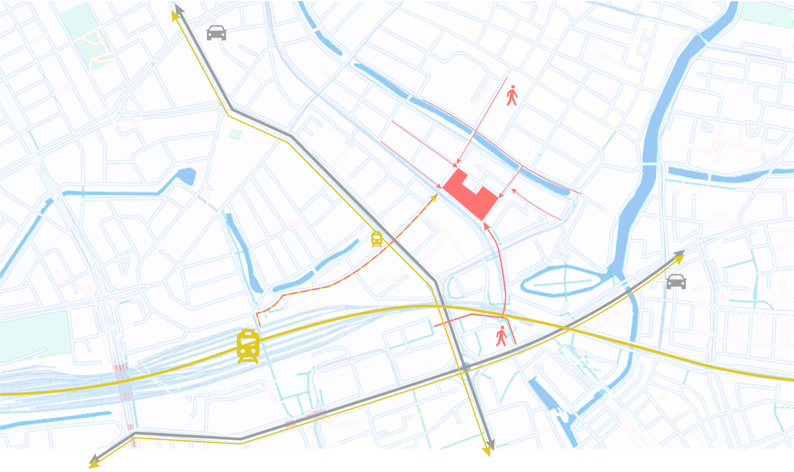

# Process of planning, forming the Program of Requirements 

## *Building identity*

   

The building exploits the benefits of collectivity as much as possible while limiting its disadvantages. With keeping privacy in mind, the collectivity will provide a better housing situation and a stronger social connection for every inhabitant. The green of the building and surroundings will contribute to a better and resilient neighbourhood. The energy-neutral building in combination with the green and sustainable design will be ready for the future and will form an example and a benchmark for other buildings. 

## *User Experience*
### **Students**
The live-work-play coöperative forms a home basis for the students, where they are not only living with other students, but where they find collective spaces with many extra possibilities. They can make use of the co-cooking kitchen to invite friends and family over and enjoy all the other facilities provided in this building, like the gym and the co-working spaces. The mix with other users gives the student the opportunity to get a discount on their rent by spending time with and helping the elderly and by babysitting the children of the starters. To make this work, a bulletin board is central in the community centre, where people can ask for and give help, products or even leftovers. The community centre forms a place to connect with other users, but also provides a lounge space where they can relax and enjoy a drink, read a book or have friends over. 

### **Elderly**
The elderly in the building will have all the privacy they need, and will not experience any nuisance from the students or starters. By grouping the elderly homes not only nuisance is battled, this is also efficient for elderly support, and to boost the interaction between elderly. This is done by providing coffee spaces near the apartments. Besides the privacy and tranquility in the area of the houses for elderly there are many options to stay active and be in touch with other user groups and externals. The community centre provides many entertainment options for them, and gives them a chance to interact with others. The students can help the elderly with daily tasks and do social activities. This way social isolation is being battled.

### **Starters**
The starters in this building finished their education and started to work. After a hard day at work the inhabitants enter the building without going through the collective spaces, straight to their homes. If they are in a relationship and/or having kids they will most of the time cook their own dinner. When alone or sometimes do not want to cook they choose to make use of the co-cooking space in the collective area. The dwellings of the starters are big enough to expand the household and have room for teleworking. Therefore the dwellings are well sound isolated and contribute to the privacy of the inhabitants. The starters can do anything in their home with keeping their privacy, but when they need social contact or longing back to their student life they go to the community centre or the bar for seeing a movie or socializing with others. While the starters are busy with their career and family, they could still help in the buildings’ household activities, like helping the elderly, cooking for people or doing activities. 
The building gives starters the opportunities to work near their home with office workspaces, fab labs and other working rooms. Therefore combining family-life and working will be a nice experience. Still, the majority of the people will work somewhere else. For them, students and elderly can help the starters by providing day care for the children they might have.

### **Externals**
By adding this building to the neighbourhood, the area gets more lively and all the shops and restaurants will get an economic boost. Thereby, the overall quality of the area can improve and it gets more interesting to go there. A second improvement where externals profit from, is the addition of greenery in the scene. These greenspaces will make the place less rough and gives it even more the reason to go there and enjoy the lively neighbourhood. 

  

## Key Performance Indicators
**Collectivity**

* Connect all residents by creating collective (indoor and outdoor) spaces, providing an inclusive living environment.
* Give the different target groups the option to mix together, but also be able to seclude from each other to have the perks of living together, but not the disadvantages. 

  

**Home quality**

* Make sure every house has a view and a low proximity to green space 
* Maintain privacy in every residence
* Ability to enter the building without going through the collective spaces
* Minimise noise disturbance (nuisance) within the building

**Diversity in audience**

* Create a diverse offer of residences
* Spread target groups within the building

**Sustainability**

* An opportunity for a green focussed design, where collectivity and sustainability can be connected
* optimize roof and orientation for solar panels
* Modularity 

  

**Self-sufficient**

* Energy-neutral (BENG)
* implement vegetable garden to actively involve residents in sustainability and connect with each other (> close to co-cooking)

## *Improvements on the site*

* Offering students of the nearby hospitality school the possibility to gain experience in the cocooking kitchens and pub. 
* Linking the greenery of the surrounding are with the greenery on site to improve the green image of the neighbourhood.

* Connecting local amenities towards the public amenities on site so that the local amenities attract more business. 
* Improving the overall ambiance of the neighbourhood 

## *Space sizes*
### Estimation internal and external occupation/traffic
Internal inhabitants: 30 elders, 80 students + 100 * (2.0) = 200 starters. This equals 310 internal tenants. 

External traffic: According to Rotterdam statistics the neighborhood Agniesbuurt in Rotterdam has =/- 4100 inhabitants. 

Estimation community: 
70% of the people (18 and older) are members in a club/community. 
310 * 0.7 = 217 members. 
310*0.12 = +/- 40 members are in hobby clubs
310 * 0.12 = 37.2 = 38 internal people will engage in hobby like activities
310 * 0.15 = 64.5 = 65 internal will engage in voluntary work for elders/neighbors/disabled

### Space areas

  <b>
0 Community centre </b>
cinema + co-cooking + library + workshop room + 15%

[**1 Cinematheque**](https://www.acousticfrontiers.com/wp-content/uploads/2015/03/17a-View-angle-plan.gif)
35 m2 for 15 people
70 m2 for 30 people. There are big cinemas nearby, so therefore the community has a small cinematheque.

[**2 Co-cooking**](https://img.wongnai.com/p/1920x0/2019/05/02/3efb4ab0fcaf4ec9aa591c4e65618821.jpg)
Cooking in pairs (or more?); if full time used: 160 = 80 pairs. Assuming cooking around 16:00-20:00, 1 hour each pair: 80/4 = 20cooking units needed.
per co-cooking unit 6m2 * 20 = 120 m2 + storage space 40 m2 + 15% = 190 m2

[**3 Library**](https://www.planning.org/pas/reports/report241.htm)
10 seats per 1k users. Community library: 217+4100 members = 43.17 seats. 
2500 square feet = 232 m2

[**4 Workshop room**](https://www.spacebase.com/en/)
20 covid proof spaces for workshop, or 50 standing = 200 m2 (20 in 200m2 is possible too, but tighter)

[**5 Fab labs**](https://upload.wikimedia.org/wikipedia/commons/d/d7/Amsterdam_Fab_Lab_at_The_Waag_Society.JPG)
8 m2 per fab lab tafel. 
310*0.12 = +/- 40 members are in hobby clubs
15 tables * 8 = 120 m2 + 15% = 138 m2

[**6 entrance hall**](https://www.appartementeneigenaar.nl/vve-onderhoud/entree/entree-appartementencomplex)
100+80+30 = 210 / 6 = 35
35 * 1m2 = 35 m2
+
+/- 310 people need to enter. Let's say 4 entrances (every four cardinal direction): 310/4 = 78 people need to enter.
[+/- 30m2 per entrance](http://universaldesign.ie/Built-Environment/Building-for-Everyone/2-Entrances%20and%20Horizontal%20Circulation.pdf) 

[**7 parking**](https://www.dimensions.com/element/90-degree-parking-spaces-layouts)
+/- 22 m2 * amount of cars + entrance etc.
0.5 parking lot per apartment (80+30+100 * 0.5 = 210) = 105 spots
2310 m2 + 90 m2 entrance etc = 2400 m2 underground parking.

[**8 assisted living**](https://www.sheerenloo.nl/in-de-buurt/bosweg-30-31-32-33-34-35-36-37-38-1)
(Beschermd wonen ‘s Heeren Loo: 225-230 m2 per group of 6-7)
30 units = 225*5 (30/6) = 1125 m2

  <b>
9 starter housing </b>
(80m2 per unit)
100*80 = 8000

  <b>
10 student housing </b>
(reference floor plan)
+/- 30 m2 * 80 + 15% transport etc = 2400 m2

[**11 cafe pub restaurant**](https://totalfood.com/how-to-create-a-restaurant-floor-plan/) 
200 seats
3000+2000 = 465 m2

[**12 arcade**](https://www.gamestate.com/theHague/)
600 m2

[**13 shop**](https://www.gecurrent.com/ideas/how-is-the-grocery-store-footprint-changing#:~:text=Grocery%20Stores%20Get%20Smarter%20and%20Smaller&text=While%20the%20average%20size%20of,regularly%20measuring%20closer%20to%2012%2C000)
12000 sq ft = 1115 m2

[**14 Co working spaces**](https://ec.europa.eu/oib/pdf/mit-standard-building-specs_en.pdf)
“The ideal architectural module of office space is 1.20 meters, but could be between 1.20 and 1.40 meters” 4*1.40 + 20% space between/routing = 6.8 m2
80 students/starters : 20 co working spaces. 20*6.8 m2 = 136 m2

[**15 Start up office**](https://www.tauro.nl/office-spaces)
Modular units rentable from 25m2 
100 starters, 50 units (external rentable when empty)
1250 m2

[**16 Gym**](https://heartlinefitness.com/5-basic-rules-thumb-sizing-fitness-centers-clubs/#:~:text=In%20terms%20of%20allocating%20square,%2C%20closets%2C%20restrooms%2C%20etc)
310 internal, 20% = 62 tenants. 
4100 externals, 20% = 820 tenants. Nearby (walking distance) gym amount: +/- 12
820/4 [ours will be 4th big one](https://cdn.discordapp.com/attachments/779254012746530854/781827970826108958/unknown.png); there's actually more but assuming the are smaller in capacity) = +/- 205
62+205 = approx 267 people will use the gym = 10-12 square feet for each member (1.1m2). 
= 267*12 = 3204 square foot = +/= 300m2

[**18 coffee hub assisted living**](https://i.pinimg.com/originals/ea/e4/cc/eae4ccc2374571e1da4113891b892a86.jpg)
10 m2 per hub, 3 hubs in between every unit group = 30 m2

[**19 coffee hub starters**](https://i.pinimg.com/originals/ea/e4/cc/eae4ccc2374571e1da4113891b892a86.jpg)
Every 20 units 10m2 hub = 50m2

[**20 coffee hub students**](https://i.pinimg.com/originals/ea/e4/cc/eae4ccc2374571e1da4113891b892a86.jpg)
Every 20 1 hub, 4 * 10m2 = 40 m2

