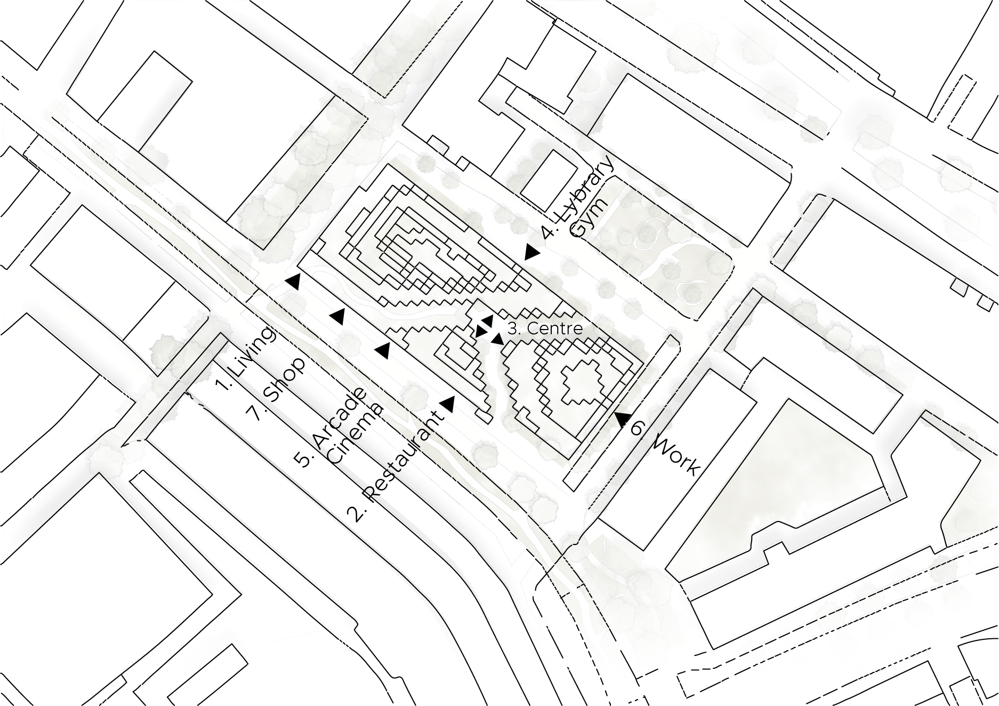

# Public entrance analysis 

### Explanation

The building has been divided into 3 parts; Work, Live & Recreate. These parts are positioned on the building plot based on their relation with the direct surroundings. Work is located near offices, Live is located near houses and Recreate is located next to the hofbogen with its retail & park. The entrances are then placed in one of the 3 parts where they belong. 

-	Entrance 1 – Living (Live): 
This entrance is placed on the far left corner. It could not be placed around the corner, because that street is not meant for cars but for pedestrians and bicyles. We wanted to preserve that street and therefore the entrance is placed on the left corner, giving residents easy access to the parking lot.
-	Entrance 5 – Arcade & Cinema (Recreate):
Facing the recreational Hofbogen this street could become more lively with an entrace to the arcade and cinema.
-	Entrance 3 – Centre (Live, Work, Recreate):
These entrances are located in the heart of our building plot. Each building part will have an entrance here with a cafeteria.
-	Entrance 4 – Lybrary & Gym (Live):
This entrance is placed in a way that it is close to both the Work area and the Live area. It is located on the other side of the building in contrast to most of the entrances. This is done to have access from multiple directions and to make sure that part of the site is used as well. This is also a calmer area than near the hofbogen
-	Entrance 2 – Restaurant (Recreate):
The restaurant will make a good connection with the restaurant under the hofbogen.
-	Entrance 6 – Work (Work):
Located at a road accessible for cars and facing other offices this is a good place for this entrance.
-	Entrance 7 – Shop (Live & Recreate):
The entrance is located between the recreational area and the living area facing other retail at the hofbogen.




### Distance lattice

In this vizualization you can see the several different distance lattices we have made for the public entrances.


### Pseudo code


``` python

1.	Calculate distance from every voxel to every voxel using Floyd warshal algorithm
2.	Save result in a dist_matrix
3.	Choose entrance voxel
4.	Get distance from the corresponding row in the dist_mtrx
5.	Find the maximum value
6.	Normalize


```

[Public entrance analysis full notebook](/spatial_computing_project_template/index/scripts/entrance_access/)