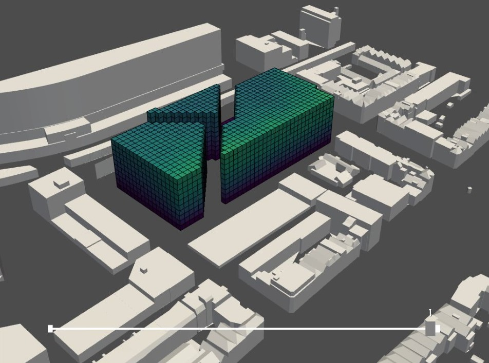
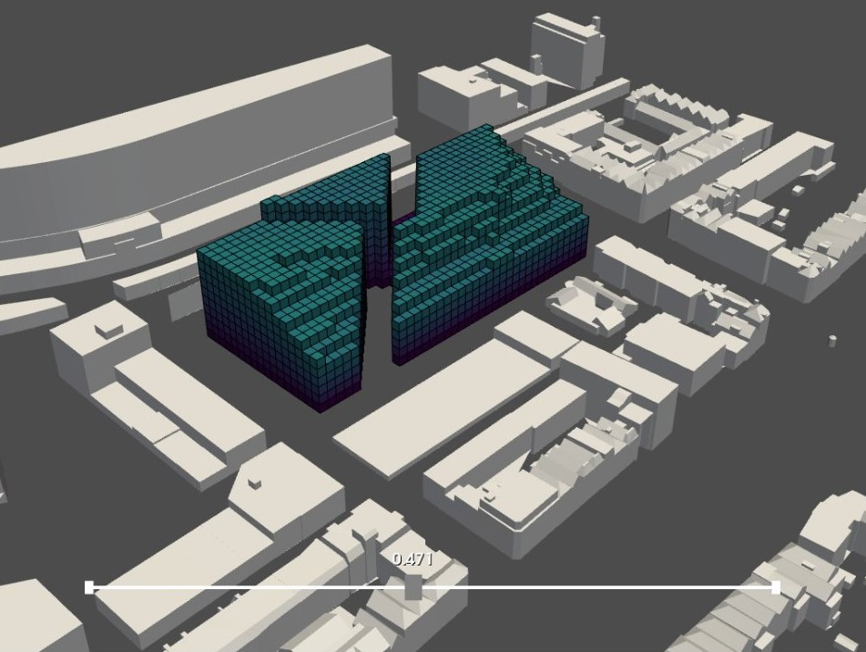

# Shadow casting analysis 
### Explanation

The second analysis is the shadow casting analysis. With this analysis we want to see which part of the building is casting shadow on the surroundings (including the park). The voxels that casts most shadow are being removed from the envelope. 

To see which exact voxels these are, we are computing intersections between shooting rays and the context mesh. If a ray does not intersect with the context, a voxel has stand in the way and will cause shadow.

### Envelope before



### Envelope after




We have removed the voxels that have over 47 percent of intersections by generating an envelope based on the selection.

### Pseudo code

``` python
Input: voxelized envelope csv 
(low and high res), context mesh 

1. Import Meshes 

2. Import Lattice 

3. Import Sun Vectors 
import sunpath (ladybug) coordinates Rotterdam 
reduce the number of sun vectors (days and hours) 

4. Compute intersection 
sun direction = sun_vectors 
find the centroids of the voxels 
shoot rays from the pixels that represent the sun to all of the centroids 
find intersections of the rays with the context mesh 

5. Make Shadow Casting lattice 
make a list out of the rays that had an 
intersection 


initiate the list of ratio 
    iterate over all of the voxels 
    count the intersection 
        iterate over all of the sun rays 
    compute the percentage of rays that did not intersect 
    (that voxels is causing shadow) 
    add to the list = vox_shadow_casting 

6. Interpolate shadow casting lattice and voxe¬lized envelope csv (high res) 

Output: voxelized envelope after shadow analysis (low and high res)


```

[Shadow casting analysis full notebook](/spatial_computing_project_template/index/scripts/shadow/)

