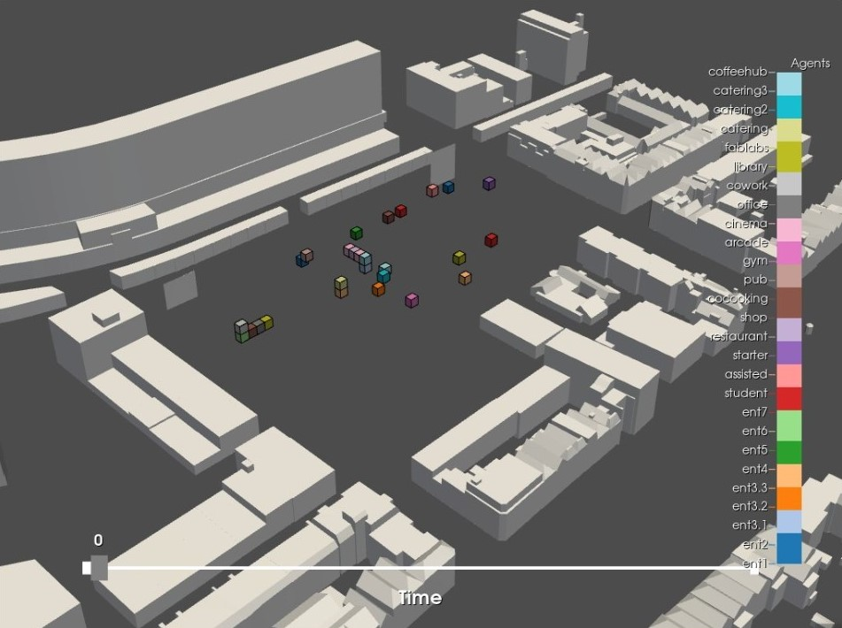

# Seed allocation

### Explanation 

We have stored all the lattices we have computed before and used them to locate the agents. The agents are placed inside a voxel that is, according to the specific preferences, the optimal voxel to be in. 



### Pseudo code 
``` python
1. For each function
Find the best voxel with the higest score based on
their criteria(0 till 1) and the enviromentall info (0
till 1)
Enviromentall info:
- Entrance Acces
- Sun Acces
- Noise
- Green Acces
- # Facade Acces
- # Floor Acces
Set voxel as occupied
```
[Seed allocation and Agent growth full notebook](/spatial_computing_project_template/index/scripts/abm/)

<span style="color: #76AB24;">*To make the seed allocation better we could have implemented some improvement. First of all we could define a hierarchy in what order the agents are placed. So first the most important agents are placed and then the less important ones. We could also add more criteria like floor preference, closeness to façade and a repel option that makes sure functions will never be crammed in a corner and thus leaving space for each other to grow without being interrupted by each other at the start. *</span>


