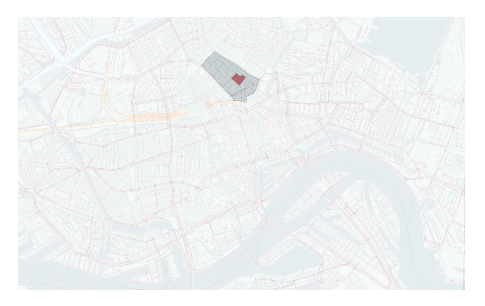
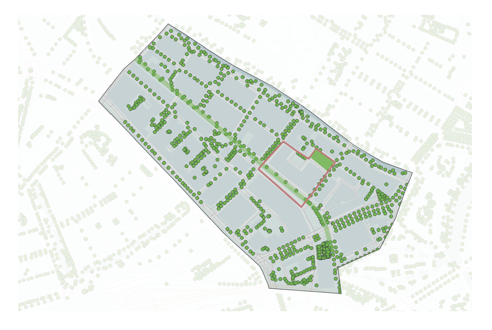
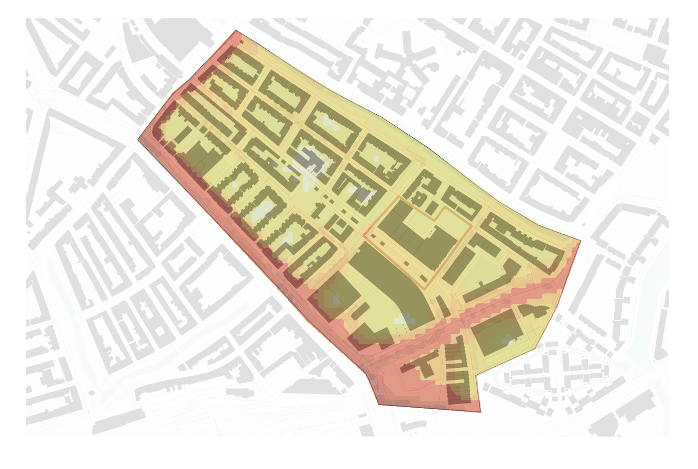
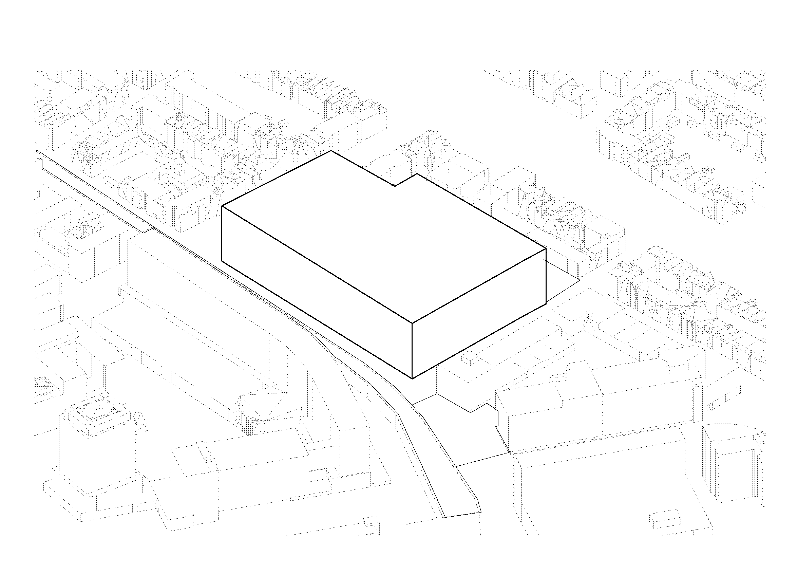
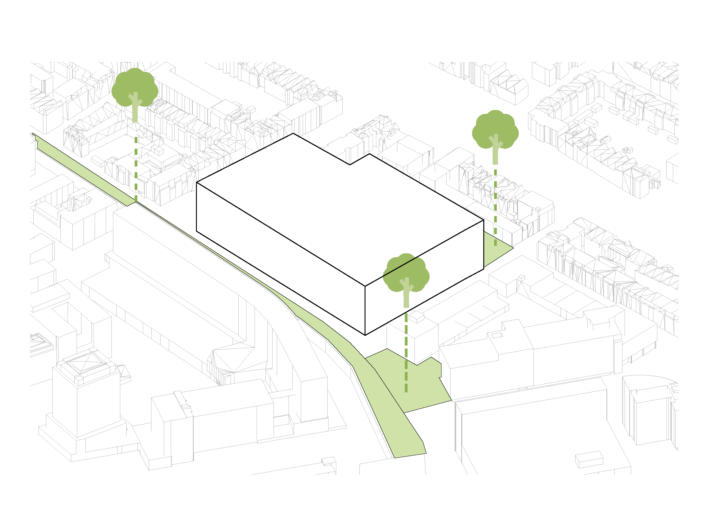
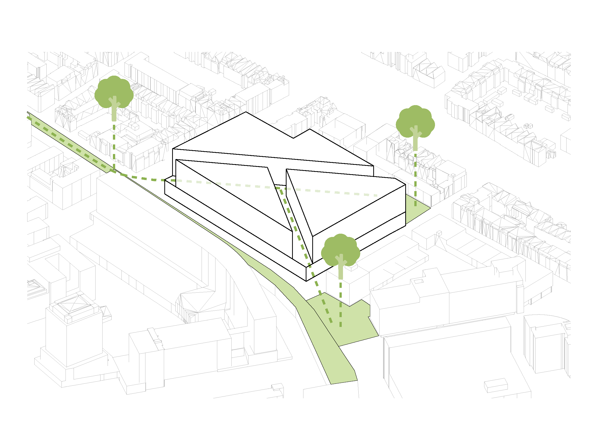
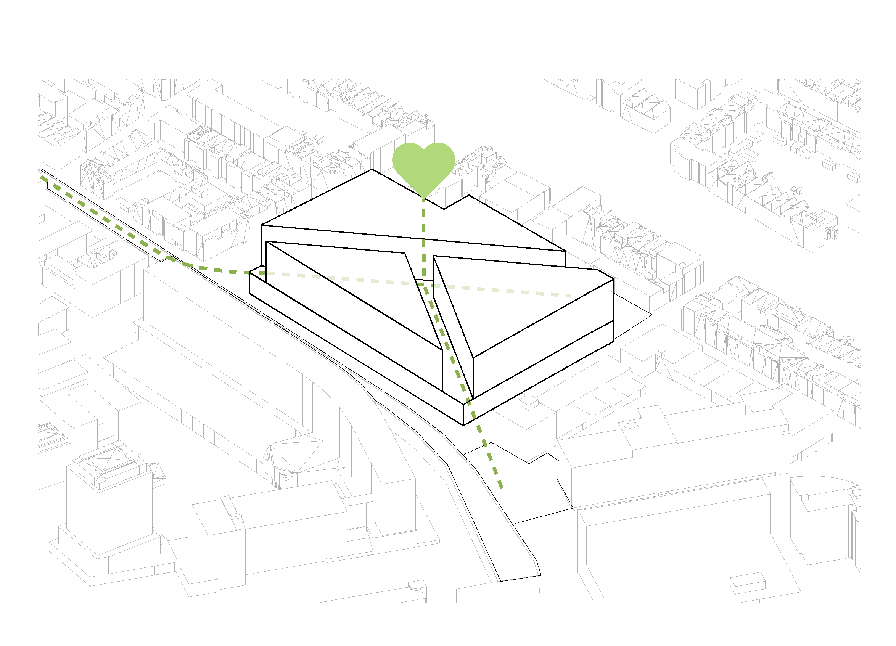
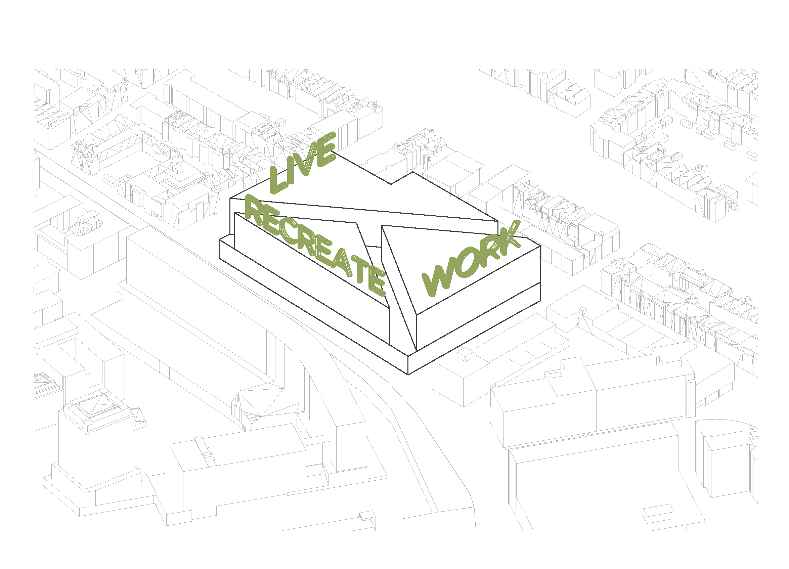
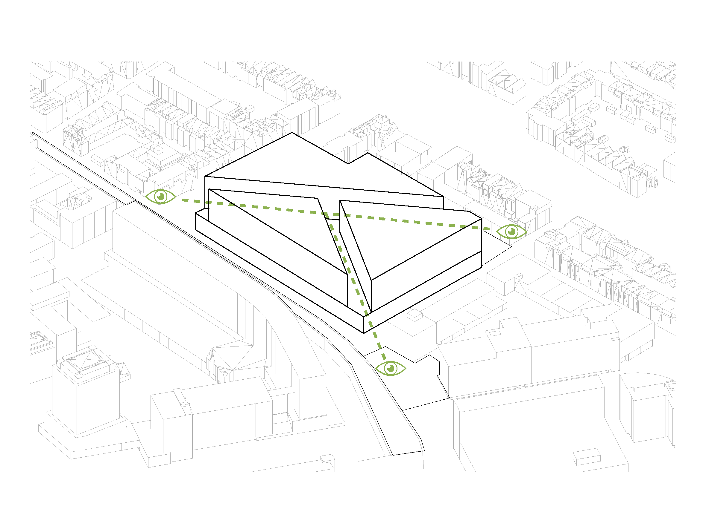
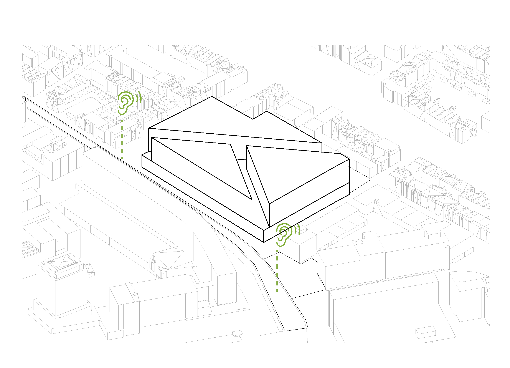

# Planning

## Urban Analysis

Before we specify the conditions of our project on the building scale we did a short analysis of the urban context.The plot for this project is located in the Agniesebuurt in the northern part of the city. 

**Rotterdam**

The Agniesebuurt is a neighborhood located in Rotterdam-Noord. 

**Buildings**

On this map we see the plot with its neighboring buildings.

**Green**

On this map we see the plot with the green spaces in the neihborhood.

**Noise**

On this map we see the plot with its neighboring buildings and the amount of noise which is created by for example traffic.

## Design Goal

For the beginning of the project we have defined our main Design goal as the following:

*The designing of an optimal building with respect to comfort and sustainability.*

But since this is of course a very broad notion of a design goal we have parted the main goal into several topics of which we think are important and useful for the design.  

### Envelope

We started this project of course with an envelope. This is the complete optional envelope which is given to us by the supervisors from the TU-Delft and is based on regulations of the municipality. 

### Public greenery

The first thing we examined was the public greenery in the nearby neighborhood of the building. We found that there where three important green spaces, namely the Hofbogen which will be a flourishing park in the future. Then there is the small but important park between the Almondestraat and the Schoterbosstraat on the North East side of the building. And finally on the South East side of the plot there will be a Raingarden. A green area which will be able to collect and drain  a lot of rain. All these three green spaces are perfectly fit to recreate as well. 

### Connection 

We think that these three public green spaces are very important to people, because it's super healthy and people can recreate and meet other people. Therefor we want an optimal connection with them. That's why we came up with the idea to create a direct connection from the centre of the building to these spaces.

### Heart

Because of this connection to the centre of our building, what will appear is a heart of the building. A place where this connections meet, and where the different building parts meet. 

### Functions

As you can see our building will be sort of parted into three. After an investigation of our program of requirements and the functions which are already there in the ZoHo quarter, this actually perfectly fits into the urban network of the plot. We make a distinction between a living, working and recreation area. 

### Visibility

As a result of our conceptual shape of the building we think that we can easily improve the visibility of the envelope. There will namely also be visual connection because we have parted the building in three. This is something we need to examine. 

### Noise

After our building has taken shape we do also want to examine the noise because the plot is located in the centre of a huge city like Rotterdam. 