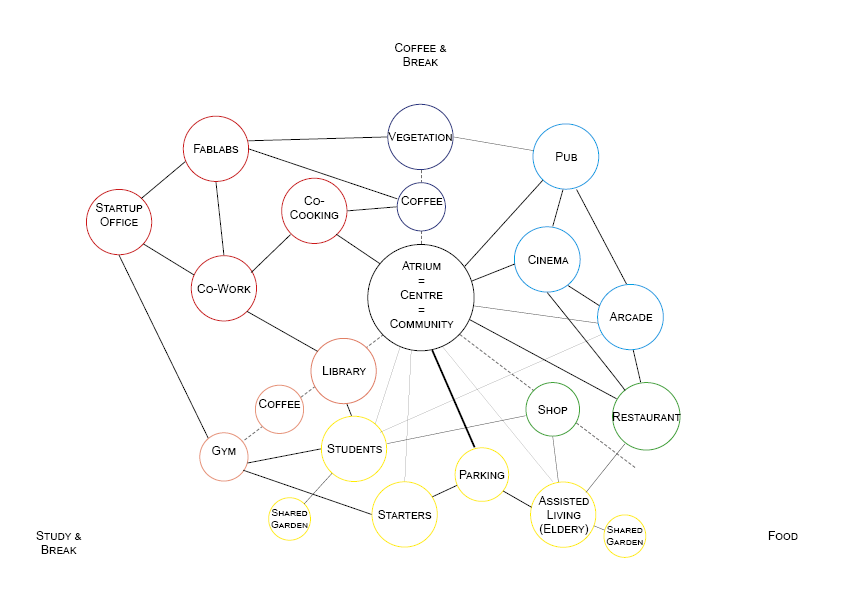
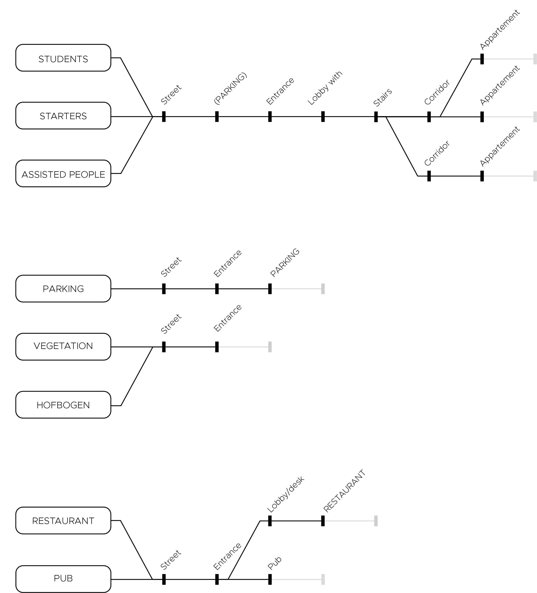
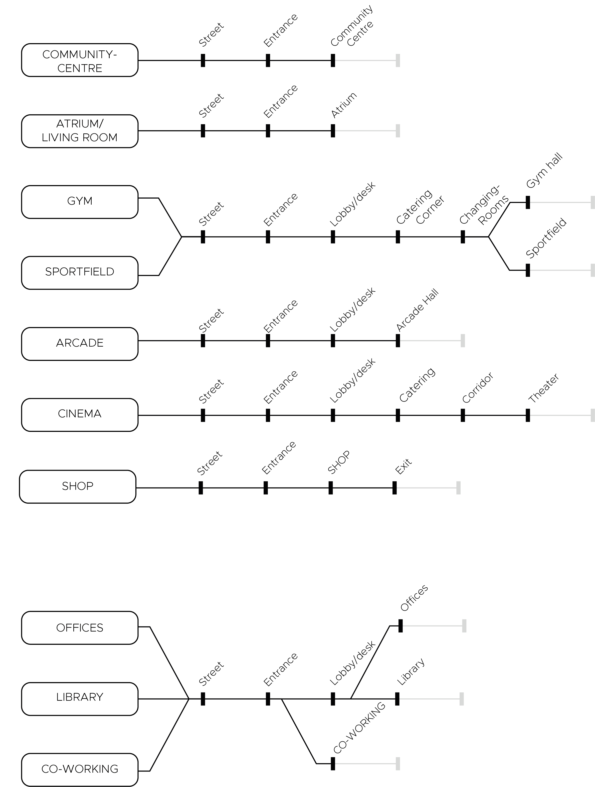
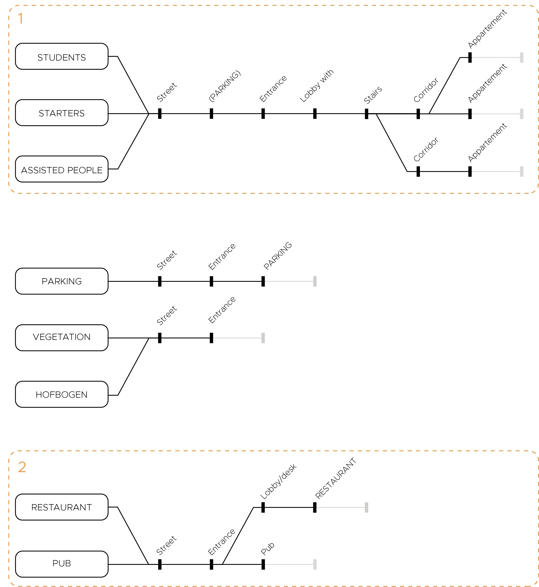
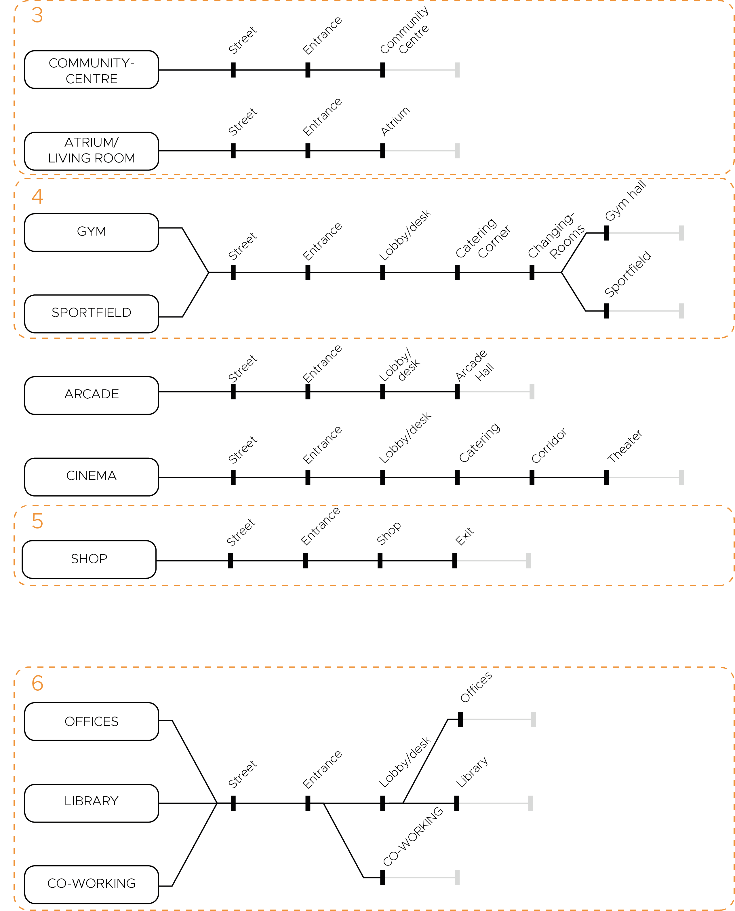

# Planning

## Bubble Diagram

With the notion of the three main building parts in our head we started with bubblediagram where again you can see the distinction between a living, working and recreation part. 

## Sequences

### Sequences with network

Before we started with a metrodiagram with all the connection in one drawing, we introduced an in between step in which we first examined all the sequences for each function there are, entering the building. 

### Sequences with entrances

As you can see we can cluster some function. With notion it's much easier to assign entrances. 

## Metro Network

Finally we combined all the drawings above into one big complete metro network, in which we spread out our combined sequences with an entrance, each on the right spot following on the bubble diagram. 

<iframe src="https://drive.google.com/file/d/1yMHorXpLPfnwIGiIIhFcOogj66GRHLWt/preview" width="640" height="480"></iframe>
