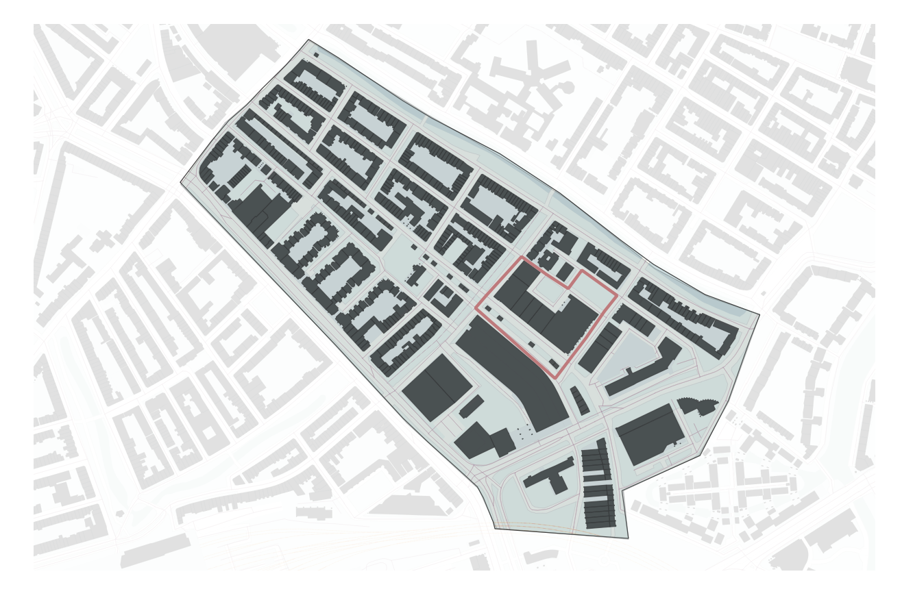
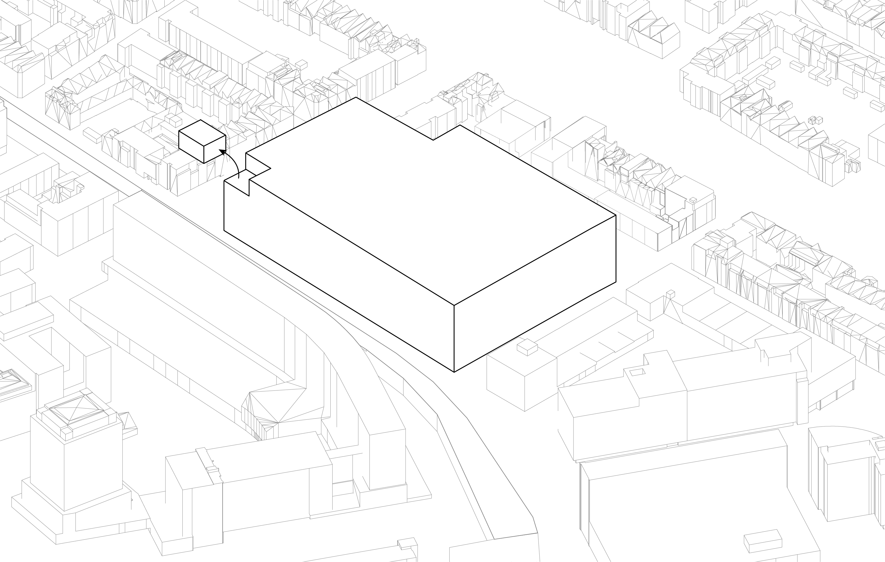
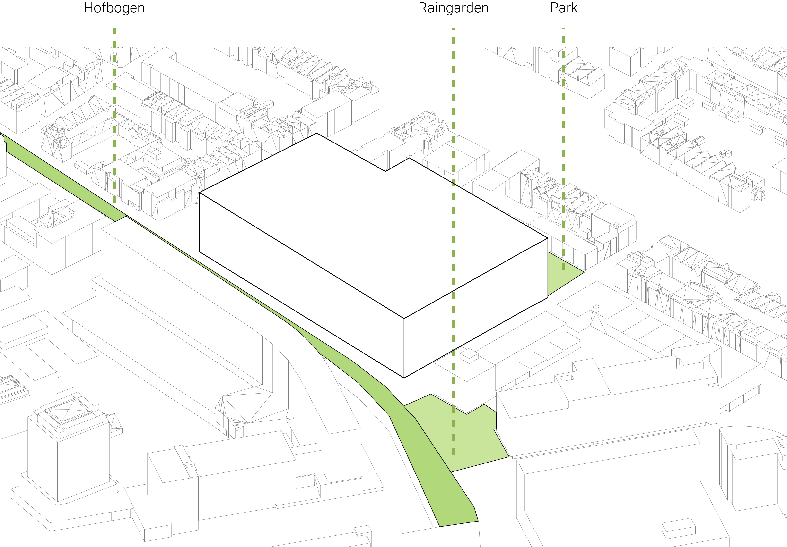
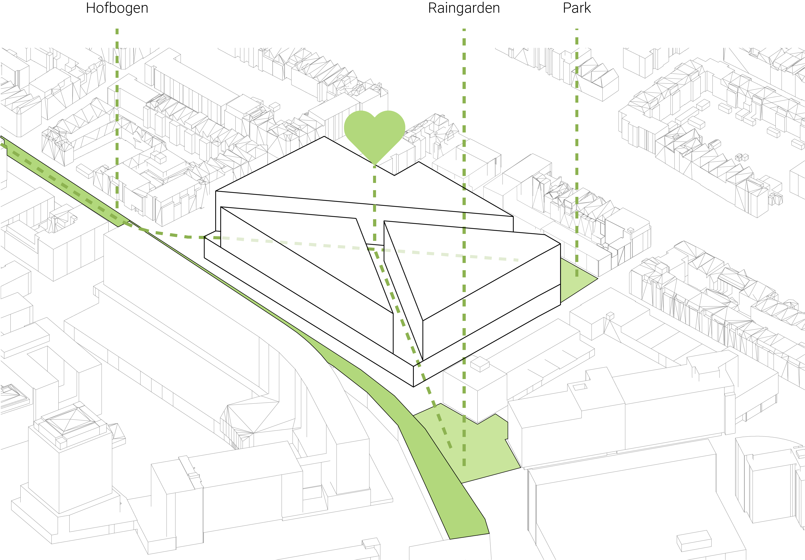
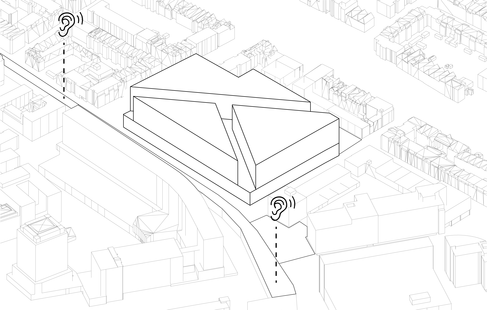

# Planning

## Urban Analysis

Before we specify the conditions of our project on the building scale we did a short analysis of the urban context.The plot for this project is located in the Agniesebuurt in the northern part of the city. 

**Rotterdam**

The Agniesebuurt is a neighborhood located in Rotterdam-Noord. 

**Buildings**

On this map we see the plot with its neighboring buildings.

**Green**

On this map we see the plot with the green spaces in the neihborhood.

**Noise**

On this map we see the plot with its neighboring buildings and the amount of noise which is created by for example traffic.

## Design Goal

For the beginning of the project we have defined our main Design goal as the following:

*The designing of an optimal building with respect to comfort and sustainability.*

But since this is of course a very broad notion of a design goal we have parted the main goal into several topics of which we think are important and useful for the design.  

### Envelope

We started this project of course with an envelope. This is the complete optional envelope which is given to us by the supervisors from the TU-Delft and is based on regulations of the municipality. 

### Modularity

Before we create any form whatsoever we want the state the clear notion that we are designing a system with a modular grid as a result. This fact has some useful properties; first of all we think that a modular building is very sustainable in the sense of de-construction. 

### Green

### Connection

### Centre

### Visibility

### Noise

