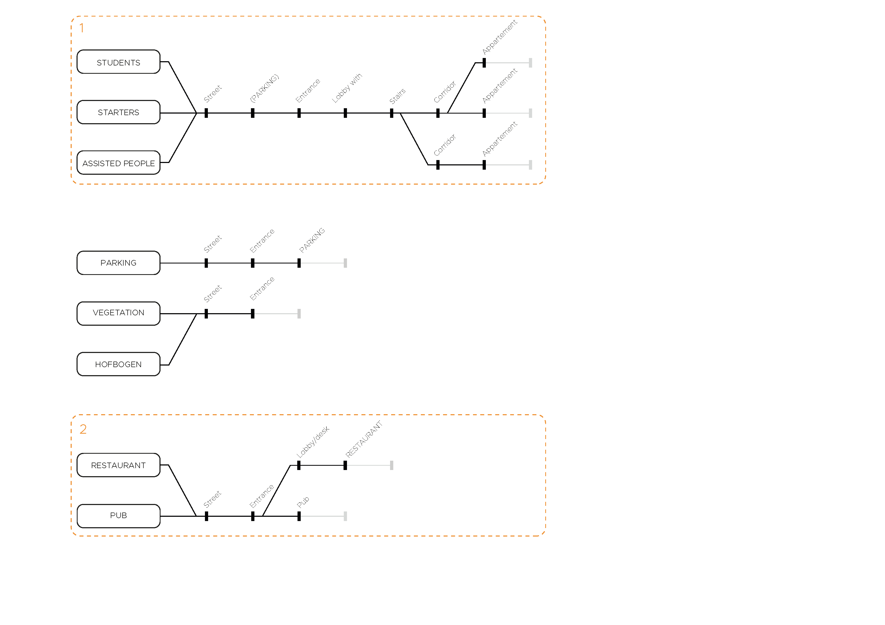
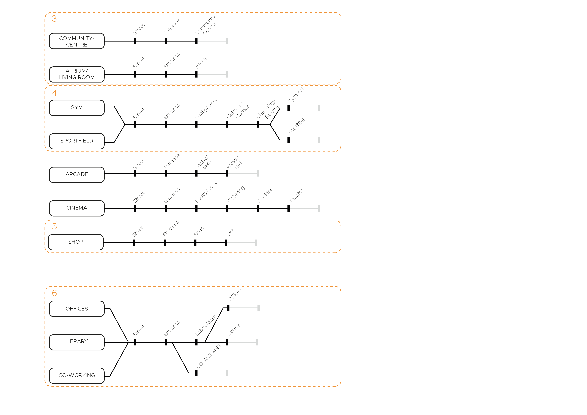
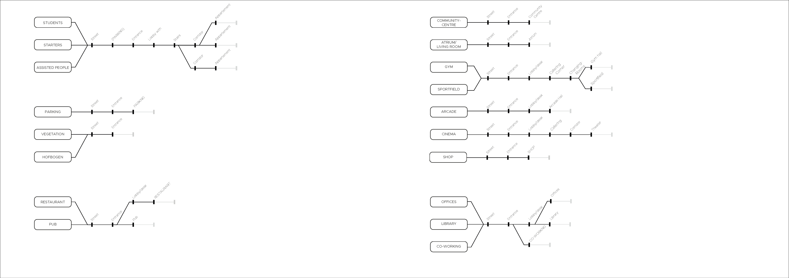
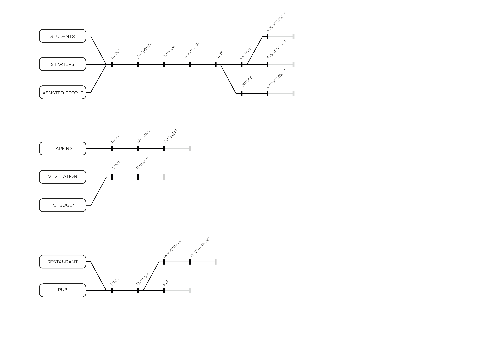
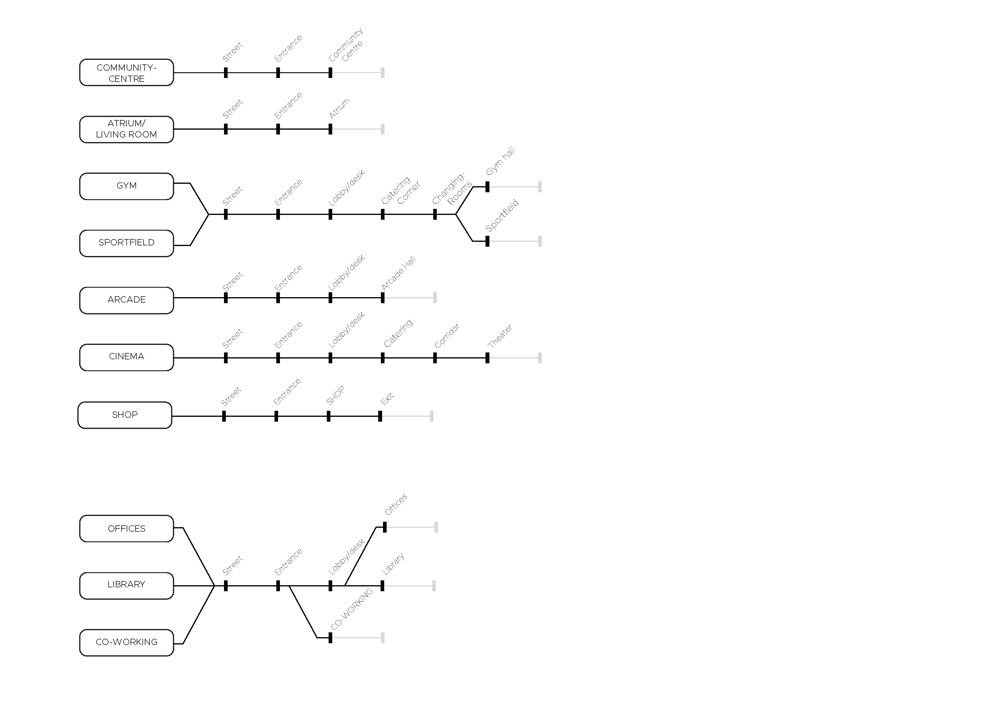

# Planning

## Design Goal

In this project the challenge is to design a housing complex incorporating several communal/public facilities for a cooperative live-work-play association. A group of graduate students and young professionals have formed this cooperative to make their own live-work-play space. The housing complex is to accommodate students, young graduates (starters), and assisted living. The complex also provides communal/public facilities, almost as a collective. 

## Urban Analysis

Before we specify the conditions of our project on the building scale we did a short analysis of the urban context through which we came to six important topics that we will discuss here.

## Sequences

### Sequences with entrances

### Sequences with network

