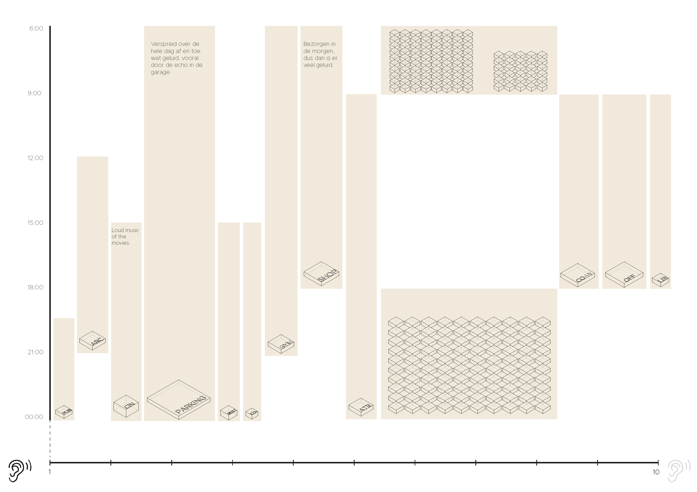

# Configuring

The configuration consists of listing the information in matrices and thinking about how we want to use this information in the analyses, simulations and optimizations on the building envelope. The size of the voxels is determined and we have started with the first part of the analyses.

## Program of requirements
After finishing the metronetwork, the square meters and some properties of the different spaces are specified in the table below.

<table><thead><tr class="header"><th>Area</th><th>m² and explanation</th></tr></thead><tbody><tr class="odd"><td>Student housing</td><td>30 m² times 80 units = 2400 m²

 
- Small private kitchen 

- Small private living room 

- Private bathroom 

- Common areas such as co-cooking and the community center. </td></tr><tr class="even"><td>Assisted living</td><td>

35 m² times 30 units = 1050 m²

- Small private kitchen 

- Small private living room 

- Private bathroom 

- Common areas such as co-cooking and the community center. <tr class="odd"><td>Starter housing</td><td>
75 m² times 100 units = 7500 m²

  
-   bedroom, bathroom, livingroom, kitchen, extra bedroom/ study room
</td></tr><tr class="even"><td>Restaurant</td><td>

80 places to sit = 104 m² (= 60% of total area)

The kitchen is 70 m² (= 40% of total area)

  
Total of 180 m² <tr class="odd"><td>Shop</td><td>
Supermarket 800 m² </td></tr><tr class="even"><td>Co-cooking</td><td>

Next to the common area, 100 m² <tr class="odd"><td>Atrium/ community center</td><td>
200 m². A place just for the residents, where people can meet their neighbours. Important is that there are different spaces from more private to more public.
 
</td></tr><tr class="even"><td>Pub</td><td>

180 m². 80 places to sit (same as the restaurant)
<tr class="odd"><td>Gym</td><td>
220 m². Mostly used by residents 
</td></tr><tr class="even"><td>Arcade</td><td>

400 m²
<tr class="odd"><td>Cinematheque</td><td>
120 visitors. The seating are is 120 m², the walking area ± 80 m²

Total of 200 m²
</td></tr><tr class="even"><td>Offices</td><td>

Shared offices are 18,5 m². There will be room for 50 employees, so 25 shared offices = 460 m²
<tr class="odd"><td>Co-work spaces</td><td>
Work group areas of 7,5 m² per employee. Place for 100 employees = 750 m²
</td></tr><tr class="even"><td>Library</td><td>

200 m²
<tr class="odd"><td>Fablab</td><td>
150 m²
</td></tr><tr class="even"><td>Parking</td><td>

Minimum of 105 parking places times 12,5 m². The total area, including the walking area = 2500 m²

</td></tr></tbody></table>

## Flowchart

<iframe src="https://drive.google.com/file/d/1Jk-lnSuOwX9CxJESQCCwzEAuu9EqvZts/preview" width="640" height="480"></iframe>

Now that we have a program we can start thinking of the analyses we want to do for the building. We came up with six different analyses, that are important for achieving our design goal.

## Matrix of connections

Before we dived into the analyses with python, we first wanted to visualize the mapping of the relations between the spaces in the building.
We did this in several subdivisions with each there own main focus. These different themes are shown below.

### Sun analysis
The sun analysis is important for placing the spaces that require most sun in those parts of the building that have most access to the sun. Because we want the building to have an open character, it is important that there is a lot of sun and daylight. The required sun access is placed on a scale bar with a scale from 10 (as much indirect en direct light as possible) to 1 (no daylight needed)

### Public Entrance acces

### Green access

### Noise repel

## Voxel Size

After we developped a clear notice of our wants for the building, we were able to start thinking of a proper voxel size. For this we started on the micro scale namely the stairs.

<table><thead><tr class="header"><th>Riser-Thread</th><th>2x Riser 1x Thread</th><th>Ratio</th><th>Common Denominator</th><th>Voxel Size</th></tr></thead><tbody><tr class="odd"><td>180mm x 240mm</td><td>(2 x 180) + (1 x 240) = 610</td><td>3:4</td><td>6</td><td>900x900 mm
</th></tr></thead><tbody><tr class="odd"><td></td><td></td><td></td><td></td><td>1800x1800 mm
</th></tr></thead><tbody><tr class="odd"><td></td><td></td><td></td><td></td><td>3600x3600 mm</td></tr><tr></tbody></table>

## Building Envelope

Now that we have a specified voxel size, we are able to voxelize our envelope. We have chosen to make the existing building mass with the football field in between available as a new envelope. To keep as much greenery as possible, the park behind the building will be retain.  

[Voxelization full python code](/notebooks/voxelization/)

