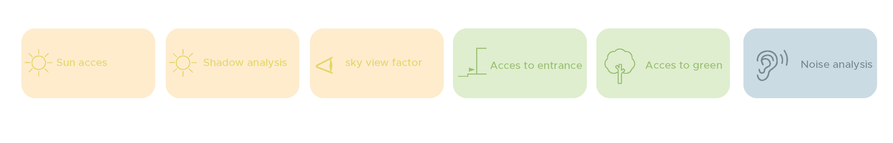
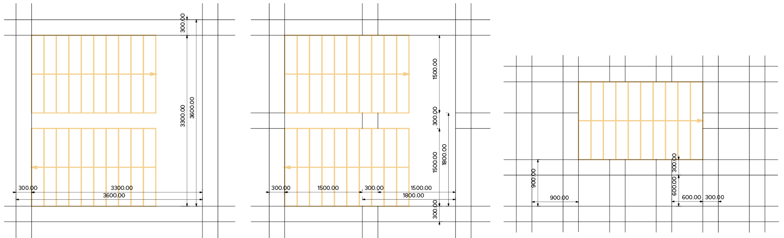
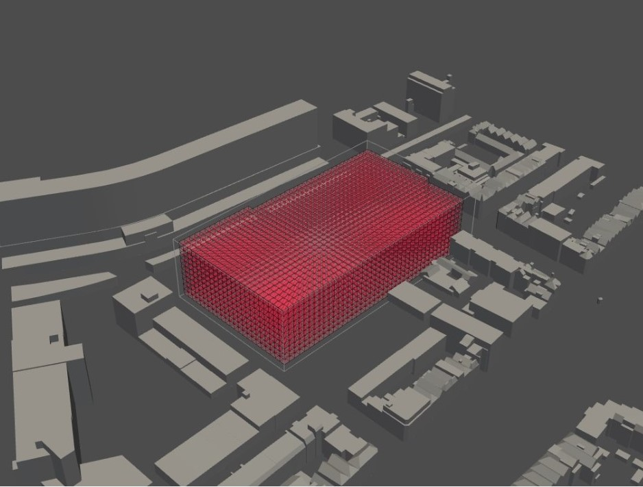

# Configuring

The configuration consists of listing information in matrices and thinking about how we want to use this information in the analyses, simulations and optimizations on the building envelope. The size of the voxels is determined and we have started with the first part of the analyses.

## Program of requirements
After finishing the metronetwork, we have specified the square meters and some properties of the different spaces in the table below.

<table><thead><tr class="header"><th>Area</th><th>m² and explanation</th></tr></thead><tbody><tr class="odd"><td>Student housing</td><td>30 m² times 100 units = 3000 m²

 
- Small private kitchen 

- Small private living room 

- Private bathroom 

- Common areas such as co-cooking and living areas. </td></tr><tr class="even"><td>Assisted living</td><td>

37 m² times 50 units = 1850 m²

- Small private kitchen 

- Small private living room 

- Private bathroom 

- Common areas such as co-cooking and living areas. <tr class="odd"><td>Starter housing</td><td>
80 m² times 100 units = 8000 m²

  
-   bedroom, bathroom, livingroom, kitchen, extra bedroom/ study room
</td></tr><tr class="even"><td>Restaurant</td><td>

80 places to sit = 104 m² (= 60% of total area)

The kitchen is 70 m² (= 40% of total area)

  
Total of 180 m² <tr class="odd"><td>Shop</td><td>
Supermarket 800 m² </td></tr><tr class="even"><td>Co-cooking</td><td>

Next to the common area, 200 m² <tr class="odd"><td>Atrium/ community center</td><td>
Will be the outside hart of the building.  
</td></tr><tr class="even"><td>Pub</td><td>

180 m². 80 places to sit (same as the restaurant)
<tr class="odd"><td>Gym</td><td>
325 m². Mostly used by residents 
</td></tr><tr class="even"><td>Arcade</td><td>

585 m²
<tr class="odd"><td>Cinematheque</td><td>
300 visitors. The seating are is 225 m², the walking area ± 90 m²

Total of 315 m²
</td></tr><tr class="even"><td>Offices</td><td>

Shared offices are 18,5 m². There will be room for 400 employees, so 25 shared offices = 3680 m²
<tr class="odd"><td>Co-work spaces</td><td>
Work group areas of 7,5 m² per employee. Place for 400 employees = 3000 m²
</td></tr><tr class="even"><td>Library</td><td>

650 m²
<tr class="odd"><td>Fablab</td><td>
1300 m²
</td></tr><tr class="even"><td>Parking</td><td>

Minimum of 105 parking places times 12,5 m². The total area, including the walking area = 2500 m²

</td></tr></tbody></table>

## Flowchart

Now that we have a program we can start thinking of the analyses we want to apply on the building. The first step is to voxelize the optional envelope. Next, we came up with three different analyses, that will cause our building to change in size and create our final envelope. The following four analysis are important for achieving our design goal and to determine which area should be placed inside which voxels of this envelope. We will model the envelope based on the preferences and characteristics of the agents.

<iframe src="https://drive.google.com/file/d/1HaQ5PTKyPxDFbxqR-wJ1XA5VJ8S4JyBo/preview?resourcekey=null" width="640" height="480"></iframe>

## Relations

Before we dived into the analyses with python, we first wanted to visualize the most important mapping of the relation between the spaces in the building and a part of the analysis.
We did this in several subdivisions with each there own main focus. These different themes are shown below.

### Sun access
The sun access analysis is important for placing the spaces that require most sun in those parts of the building that have most access to the sun. Because we want the building to have an open character, it is important that there is a lot of sun and daylight. The required sun access is placed on a scale bar with a scale from 10 (as much indirect en direct light as possible) to 1 (no daylight needed)

<iframe src="https://drive.google.com/file/d/1ZRZ_vMbT6kePPZcM8ElBhymZCF-Tktzc/preview" width="640" height="480"></iframe>

### Public Entrance access

Because the building has a great variation between public and private spaces it is important to know which one should have the best access to an entrance. The more public the space, the more important is the access to an entrance, and so the higher is the number on the scale bar.

<iframe src="https://drive.google.com/file/d/1Yvx8JlNY1SeCOMAfz2wEllVa-TceJzgE/preview" width="640" height="480"></iframe>

### Green access

Because we want to make a green atrium and path through the building, we think most spaces will have a good access to green. In the scale bar below is, on a scale from 10 (require green access the most) to 1 (does not need to have green access) shown which spaces want to have the best access to a green outside space.

<iframe src="https://drive.google.com/file/d/18gm8s6EVgV-J4K4K2yDkz-NrdefSEERP/preview" width="640" height="480"></iframe>

### Noise repel

The table below is showing the noise repel from each different space in a certain timeframe. the timeframe shows at what time the space in question produces the most sound, and could therefore be annoying to surrounded spaces. 

<iframe src="https://drive.google.com/file/d/16AffU4GKKGdLBlafOJTAFakhrvYy5UnQ/preview" width="640" height="480"></iframe>

## Voxel Size

After we have developed a clear notice of our wants for the building, we were able to start thinking of a proper voxel size. For this we started on the micro scale, namely the stairs.

<table><thead><tr class="header"><th>Riser-Thread</th><th>2x Riser 1x Thread</th><th>Ratio</th><th>Common Denominator</th><th>Voxel Size</th></tr></thead><tbody><tr class="odd"><td>180mm x 240mm</td><td>(2 x 180) + (1 x 240) = 610</td><td>3:4</td><td>6</td><td>900x900 mm
</th></tr></thead><tbody><tr class="odd"><td></td><td></td><td></td><td></td><td>1800x1800 mm
</th></tr></thead><tbody><tr class="odd"><td></td><td></td><td></td><td></td><td>3600x3600 mm</td></tr><tr></tbody></table>

## Building Envelope

Now that we have specified a voxel size, we are able to voxelize our envelope. We have chosen to make the existing building mass with the football field in between available as a new envelope. To keep as much greenery as possible, the park behind the building will be retain.  

[Voxelization full notebook](/spatial_computing_project_template/index/scripts/Voxelization/)

