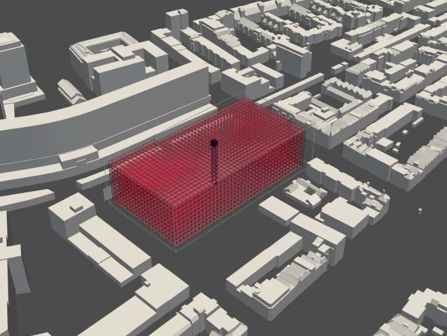
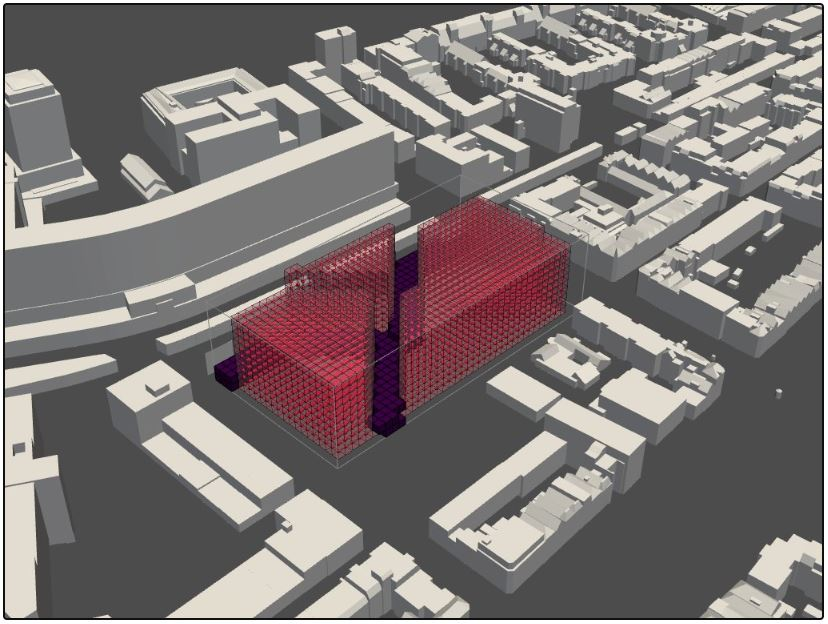

# Atrium allocation 

### Explanation

Before we dive into the several analyses we did, we first want to implement our concept into our model because this will substantially change the shape of our building.


### Envelope

 To do this we first allocated a voxel in the center of the building, by first calculating the length of the x-direction, and then calculating y-direction of the voxelized envelope, and dividing both by 2. The center of the building represents the heart and will eventually be the atrium. 



Now we need to connect the hart to the three public green spaces. This we do by the a-star algorithm to find the shortest path to the center of the building. To find it's way through the building the algorithm takes the Moore neighborhood into acount, so it can grow diagonally. 



### Pseudo code

``` python

Input: Voxelized envelope (high res) 

1. Define Stencil (Moore neighborhood)

2. Import Lattice

3. Import Agents information
1 agent that represents the atrium
3 agents that represent a public green space

4. Creation of vertical shaft
Make a shaft out of agent 0 (atrium)

4. Creation horizontal corridors
Extract the connectivity graph 
Find the shortest path from the three public green spaces to the atrium
Mark the short path as unavailable and hereby construct a corridor

5. Edit voxel
Mark two voxel in x and y direction of the corridor as unavailable
Mark every voxel in the positive z-direction of the corridor as unavailable
Mark two voxel in x and y direction of the shaft as unavailable

Output: Voxelized envelope atrium allocation and green path finding (high res)

```

[Atrium allocation and green path finding full notebook](/spatial_computing_project_template/index/scripts/atrium_allocation_and_green_path_finding/)