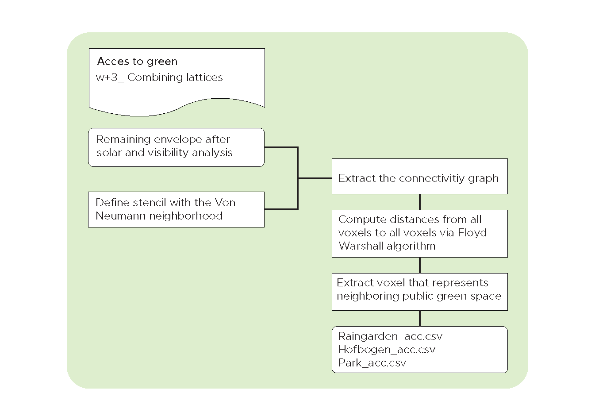
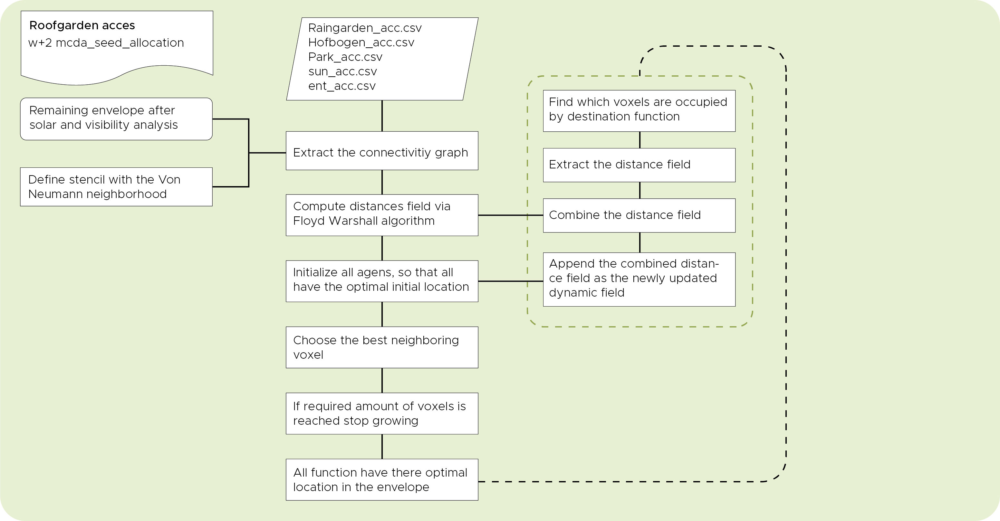

# Green Analysis

In this analysis we wanted to create some attraction to green spaces in the direct neighborhood of the envelope. The eventual goal is to minimize the graph distance of a voxel which is in need of green space, and the green space its self. In this flowchart below we explained how we have tried to accomplish this.



### Park

The first public green space we have defined is the small park betweenn the Almondestraat and the Schoterbosstraat. As described above in the flowchart we did this by extracting a representing voxel from the distance field matrix. Below you can see the visualization. 

``` python

# select the corresponding row in the matrix
ent_2_dist = dist_mtrx[422]

# find the maximum valid value
max_valid = np.ma.masked_invalid(ent_2_dist).max()

# set the infinities to one more than the maximum valid values
ent_2_dist[ent_2_dist == np.inf] = max_valid + 1

```


### Raingarden

The same process we repeated for the second green space which is the Raingarden on the south east side of the envelope.


### Hofbogen

For the third green space The Hofbogen, we extracted a complete row in the XY-direction. The rest of the process was still the same.


## Roof garden acces

Besides the three main green spaces in the near neighborhood of the envelope, there are more green space to which function could have a connection namely the roof gardens and the gardens inside of the building. These gardens don’t have a fixed location in the building and could potentially change constantly. The relation between a function and a roof garden is therefore called a dynamic relation. For now we could say that a roof garden needs to be accessible from the side, so we stated that if a voxel has no voxel above it, and at least one voxel in the XY-direction, than we make it a roof garden. To define the connectivity between a function and this dynamic location of the roof garden we altered the code a little bit which is explained in the flowchart below.




**Program.csv**

For the sake of clarity we specified a small program which will make things clear.

<table><thead><tr class="header"><th>space_name</th><th>space_id</th><th>ent_acc</th><th>sun_acc</th><th>lobby_acc</th><th>roof_garden_acc</th><th>workshop_acc

</th></tr></thead><tbody><tr class="odd"><td>lobby</td><td>0</td><td>1</td><td>0</td><td>1</td><td>0</td><td>0
</th></tr></thead><tbody><tr class="odd"><td>roof_garden</td><td>1</td><td>0</td><td>1</td><td>0</td><td>1</td><td>0
</th></tr></thead><tbody><tr class="odd"><td>workshop</td><td>2</td><td>0.5</td><td>0.5</td><td>0</td><td>1</td><td>1
</p></td></tr></tbody></table>


As you can see in the visualization our agents behave in a manner we want them to behave. We have created a tendency in the workshop function to grow towards the roof-garden no matter what its location will be.


#### To do

We would still like to write a piece of code for the allocation of the roof gardens in the manner described above. 