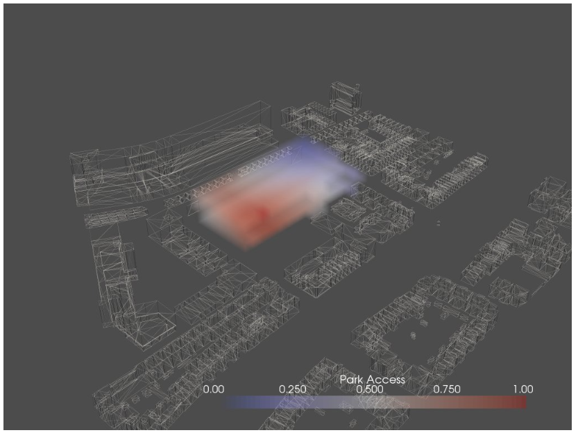

# Green Analysis

In this analysis we wanted to create some attraction to green spaces in the direct neighborhood of the envelope. The eventual goal is to minimize the graph distance of a voxel which is in need of green space, and the green space its self. To accomplish this we used the notebook offered by Shervin Azadi.

### Park
The first green space we defined is the small park between the Almondestraat and the Schoterbosstraat. We did this by extracting the index number 422, which represents the park, from the distance matrix.

<<<<<<< HEAD

=======
``` python
# select the corresponding row in the matrix
park_dist = dist_mtrx[422]

# find the maximum valid value
max_valid = np.ma.masked_invalid(park_dist).max()

# set the infinities to one more than the maximum valid values
park_dist[park_dist == np.inf] = max_valid + 1

```

>>>>>>> f264c65ce4c935ca7e78dd8c645f7afaa24905f9

### Raingarden
The same process we repeated for the second green space which is the Raingarden on the south east side of the envelope.


### Hofbogen
For the third green space The Hofbogen, we adjusted the code a little bit since we wanted to select a complete row of voxels.


**1.4 Construct Distance to Hogbogen Lattice**


## Roof garden acces

Besides the three main green spaces in the near neighborhood of the envelope, there are more green space to which function could have a connection namely the roof gardens and the gardens inside of the building. These gardens don’t have a fixed location in the building and could potentially change constantly. The relation between a function and a roof garden is therefore called a dynamic relation. 
To accomplish this we altered the code given to us by Shervin Azadi a little bit. Within the notebook W+2_mcda_seed_allocation before the agent for loop we updated the dynamic field.

### Program.csv

space_name, space_id, ent_acc, sun_acc, lobby_acc, roof_garden_acc,  workshop_acc
lobby, 0, 1.0, 0.0, 1.0, 0.0, 0.0
roof_garden, 1, 0.0, 1.0, 0.0, 1.0, 0.0
workshop, 2, 0.5, 0.5, 0.0, 1, 1.0

<table><thead><tr class="header"><th>space_name</th><th>space_id</th><th>ent_acc</th><th>sun_acc</th><th>lobby_acc</th><th>lobby_acc</th><th>lobby_acc

</th></tr></thead><tbody><tr class="odd"><td>180mm x 240mm</td><td>(2 x 180) + (1 x 240) = 610</td><td>3:4</td><td>6</td><td>900x900 mm
</th></tr></thead><tbody><tr class="odd"><td></td><td></td><td></td><td></td><td>1800x1800 mm
</th></tr></thead><tbody><tr class="odd"><td></td><td></td><td></td><td></td><td>3600x3600 mm</td></tr><tr></tbody></table>


In this visualisation we see that the workshop agent is...