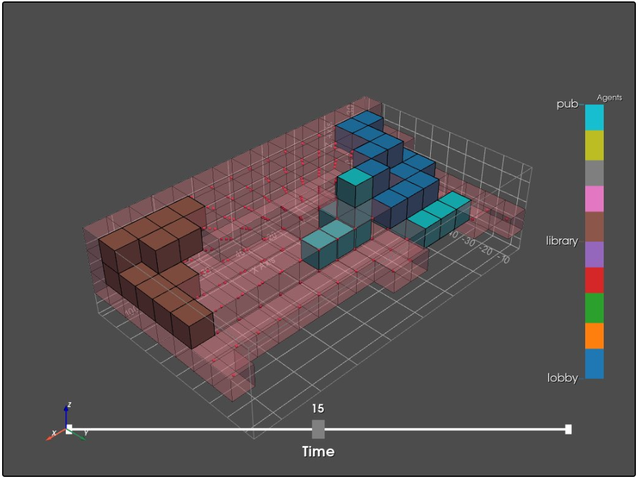

# Noise analysis

## Interior noise

With interior noise we mean the different amount of noise which could be produced by different functions. This is important in our case beceaus there are several function that allow a very small amount of noise. 

We have implemented this again in a test case with a very small program. 

<table><thead><tr class="header"><th>space_name</th><th>space_id</th><th>ent_rep</th><th>sun_rep</th><th>lobby_rep</th><th>library_rep</th><th>pub_rep

</th></tr></thead><tbody><tr class="odd"><td>lobby</td><td>0</td><td>0</td><td>1</td><td>0</td><td>0</td><td>0.5
</th></tr></thead><tbody><tr class="odd"><td>library</td><td>1</td><td>0.5</td><td>1</td><td>0</td><td>0</td><td>1
</th></tr></thead><tbody><tr class="odd"><td>pub</td><td>2</td><td>0</td><td>0.5</td><td>0.5</td><td>1</td><td>0

</td></tr></tbody></table>

As we can see in this visualization the pub does repel the library, which is eventually what we want.

#### To do

-The code we used in the example uses graph distance, where we need Euclidean distance.

-If we want to use this code, we need to be able to combine it with the same code for attraction. We need to find a way to do this, because a value 0 on the scale of repel is still something totally different than a value 1 on the scale of attraction. 

## Exterior noise