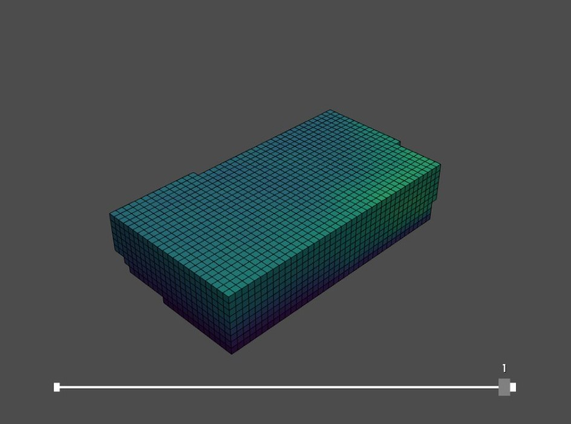

# Shadow analysis 

After removing the voxels with too little sun access, we have analysed the shadow casting of the new envelope. 

A part of the building envelope would provide shade for the surroundings. Because the building has a high height and is close to other buildings, we have removed the voxels that have a major influence on the shadow on certain parts of the immediate context.

Just like in the sun analysis, we compute many intersections. This time, however, we are computing them from the sky towards the voxels. In the code, the directions of the sun vectors are opposite to those in the sun analysis.

``` python
# constructing the sun direction from the sun vectors in a numpy array
sun_dirs = np.array(sun_vectors)

# exract the centroids of the envelope voxels
vox_cens = full_lattice.centroids
 
ray_dir = []
ray_src = []
for v_cen in vox_cens:
    for s_dir in sun_dirs:
        ray_dir.append(s_dir)
        ray_src.append(v_cen)

# converting the list of directions and sources to numpy array
ray_dir = np.array(ray_dir)
ray_src = np.array(ray_src)

```

Because we want to keep the park behind the building, we also think it is important that this remains a nice green place. That is why we have taken this into account in our analysis. we have changed the immediate context In Rhino and placed a building with a height of 1.75 meters (human height) on the park. You can clearly see the difference in the colors, and so in the shadow casting of the envelope. 

***Without park***



***With park***


We have removed the voxels that have over 45 percent of intersections by generating an envelope based on the selection. 
``` python
# 7.2. Generating an envelope based on the selection
lower_bound = 0.01
upper_bound = 0.45
lower_condition = shadow_casting_lattice > lower_bound
upper_condition = shadow_casting_lattice < upper_bound
new_avail_lattice = lower_condition * upper_condition

```
We continue the next analysis with the newly created envelope.

***New envelope***


[Shadow analysis full python code](notebooks/shadow/)

