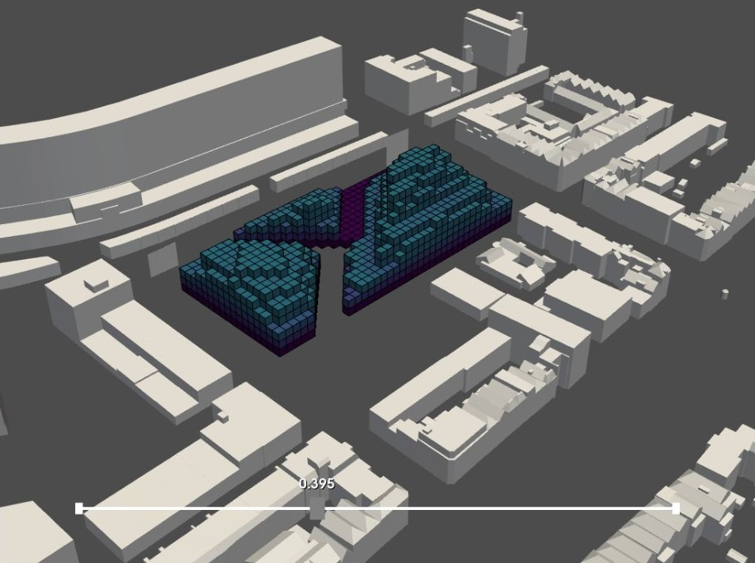

# Visibility analysis 
### Explanation
One of our starting points is to create a building that makes different connections. By this we mean connections between the various surrounding neighborhoods, between the greenery and connections inside of the building. The building should therefore not serve as a wall, but more as a passage. That is why we think it is important for people passing by, there is a good view of the sky and the surroundings. For this, we have calculated the sky view factor and, just like in the previous analysis, removed the unnecessary voxels.


We have started this analysis by creating a new context mesh. The context mesh only exists of the streets through and around the envelope. After importing the sky vectors we needed to compute the intersections between the rays in sky direction and the context. If a ray does not intersect with the street, there are voxels hindering the sky view


### Envelope before


### Envelope after




We have removed the voxels that have over 40 percent of intersections by generating an envelope based on the selection.

### Pseudo code

``` python
Input: voxelized envelope after shadow analysis (low and high res), context mesh streets

1. Import Meshes

2. Import Lattice

3. Import Sky Vectors (icosphere trimesh)
reduce the number of sky vectors (only use the ones above the horizon)

4. Compute intersection 
sky direction = - sky_vectors
find the centroids of the voxels
shoot rays from the pixels that represent the sky to all of the centroids
find intersections of the rays with the context mesh 

5. Make Sky Access lattice
make a list out of the rays that had an 
intersection 
initiate the list of ratio 
	iterate over all of the voxels 
	count the intersection
		iterate over all of the sky rays 
	compute the percentage of rays that did not intersect 
    (these voxels hinder sky view from the street)
	add to the list = vox_sky_access

6. Interpolate vox_sky_access (lattice) and voxelized envelope after shadow analysis (high res) 

Output: final envelope (low and high res)


```

[Visibility analysis full python code](/notebooks/visibility/)