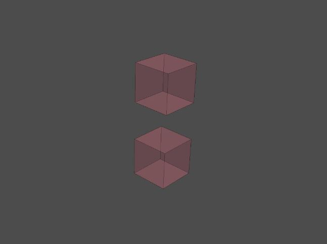
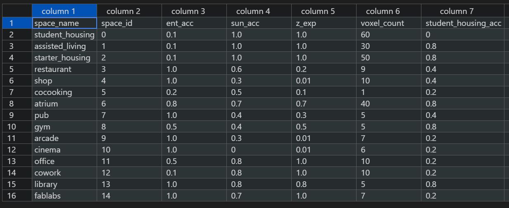
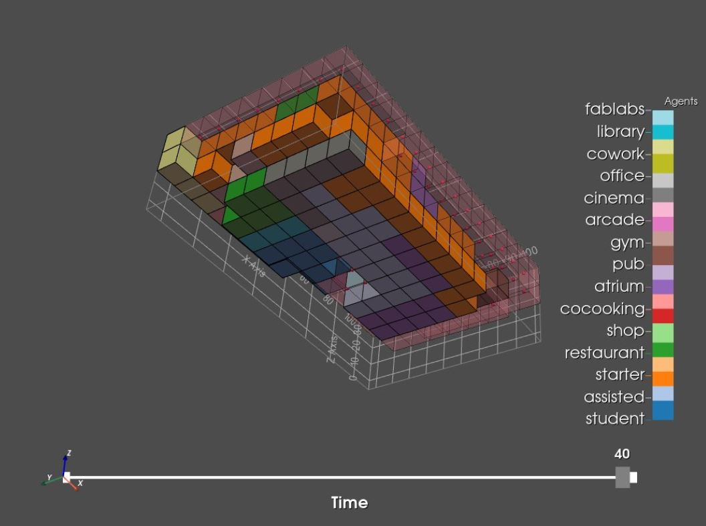

# Agent Based Modelling

### 1   Choosing the stencils

These stencils will describe how a function is going to grow in the 3 dimensional world and what shape it will end up in. We have defined two stencils. One for the z-plane and one for the xy-plane.

#### Code: Stencil z-plane
``` python
# creating neighborhood definition - center with 0 neighbours
s_z = tg.create_stencil("von_neumann", 0, 1)
# setting the center to zero
s_z.set_index([0, 0, 0], 0)
# setting z neighbours to 1
s_z.set_index([0, 0,-1], 1)
s_z.set_index([0, 0, 1], 1)

```



#### Code: Stencil xy-plane

``` python
# creating neighborhood definition - center with 1x neighbours
s_xy = tg.create_stencil("von_neumann", 1, 1)
# setting the center to zero
s_xy.set_index([0, 0, 0], 0)
# setting z neighbours to 0
s_xy.set_index([0, 0, 1], 0)
s_xy.set_index([0, 0, -1], 0)

```


#### To do
The xy-stencil could be adjusted so that it would grow more in a square like shape. The corners would be filled as well, instead of just these 4 neighbours, there would be 8. This is still a work in process and we are not sure if this should be solved with the stencil.

### 2   Agent & Enviroment Information 
Earlier we had defined the relations between functions and their Key Performance Indicators (KPI) in a matrix created in excel. This has been transformed into the program.csv where a couple criteria have been added and some are not yet  added. The ones that are added are the maximum voxel count (representing the maximum area/volume) and the preference of each function to expand in the z-direction. In the code certain variables refer to a column with these criteria for each function (located in a row). Besides the Agents criteria & relations we also need the environmental information. These pieces of information are important because they will define the placement of the functions and how they will grow and shape.

#### Code Loading Agents Information
``` python
# loading program (agents information) from CSV
prgm_path = os.path.relpath('../data/program.csv')
agn_info = np.genfromtxt(prgm_path, delimiter=',')[1:, 1:]
# extract agent ids
agn_ids = agn_info[:, 0]
# extract agent preferences
agn_prefs = agn_info[:, 1:]
# extract agent preference to expand in the z-direction
agn_expandz = agn_info[:, 3]
# extract maximum voxels of each agent agent. This represents the maximu8m area & volume
agn_vox_req = agn_info[:, 4]

```


This is a small part of the matrix used for the growing process. z_exp & voxel_count are new values.  

One of the environmental information csv’s is the one for entrances created in w+3 where the distance fields between the entrances are created. In this notebook we have selected 6 voxels as our entrances since our metromap is based on 6 entrances. The placement of these entrances is random thus far. This will have to change to make sense on the urban scale so our building connects good with the surrounding area and infrastructure. 


#### To Do
-	Add more criteria (green access, noise etc.)
-	Make sure this matrix and the one shown before are equal
-	Understand the sequence of rows and columns when new criteria are added
-	Change voxel_count into real necessary voxel count when using a higher resolution envelope
-	Add more csv’s (green access (causes problem), noise, groundfloor access, urban functions, shortest paths for pedestrians, cars, bikes, UHI-effect?)
-	Change the entrances. Perhaps these should be based on urban routes and all have separate csv’s and act as separate criteria’s? For example the most used path for cars should have quick access to an entrance where the function parking should be located.
-	Understand the order env_info picks data from the program matrix and match that with the desired data. And understand what should be added and what not. code: env_info = [ent_acc_lattice, sun_acc_lattice]

### 3   Initialize the agents
Here our functions are represented by a single voxel or agent as a starting point to grow later in the process. They are placed based on their Key Performance Indicators / criteria (sun access & entry access) and the environmental data (sun exposure, distance fields to entrances). 


There is a problem occurring here that needs to be solved which is the fact that a lot of functions are crammed into one corner leaving them no room to grow around their starting point. Shervin has provided us a starting point to solve this problem. The idea is that we create a new criteria for all functions to stay away from each other by computing the distance field of the already existing functions. 

**Code idea Shervin**
``` python
for a_id in agn_ids:    
        voxel_vals = []
        pot_voxels = []
        # retrieve agent preferences
        a_pref = agn_prefs[int(a_id)]
        # for all the voxels that are already occupied in the occ_lattice
            occ_vox_1d = np.ravel_indices(np.where(occ_lattice > -1), occ_lattice) 
            distance_to_occ = dist_mtrx[occ_vox_1d]
            # combine all of this distance lattices
            init_env_info = env_info + [init_dist_lattice]
            init_a_pref = a_pref + [1.0]
            # Voxel Evaluation Loop
            for pot_vox in avail_index:
                if avail_lattice[tuple(pot_vox)]:

```

#### To Do

-	Interpolate to create the seed allocation in the high resolution envelope
-	Solve Shervins Idea for the crammed corner problem
-	Add criteria to solve crammed corner problem
-	Alter criteria’s based on illogical placement of functions: reflection
-	Add multiple agents for housing units to optimize their connection with green areas

### 4   The growing process

During this process the agents will grow one voxel at a time for a certain amount of frames. This happens with the use of dynamic agents and a for loop, checking all the criteria and choosing a suitable neighbour.  

A the beginning of the for loop, criteria from the matrix are put in a variable that can be used in the code. 


**Code**
``` python
    for a_id in range(agn_num):
        # retrieve the list of the locations of the current agent
        a_locs = agn_locs[a_id]
        a_expandz = agn_expandz[int(a_id)]
        a_vox_req = agn_vox_req[a_id]
        a_vox_count = len(a_locs)
       
        # initialize the list of free neighbours
        free_neighs = []
        free_neigh_weights = []

```


In the code below the z-neighbours and the xy-neighbours of each agent are checked if they are available and then they are compared with the criteria of that specific agent/function whether or not it prefers to grow in all directions or just horizontally. The script Shervin helped us write makes sure that if an agent want to grow horizontally, but there is no way for it to grow anymore in that direction, it still has the opportunity to grow vertically to meet the required area. This is based on the variable criteria a_expandz.

**Code**
``` python
        for loc in a_locs:

            # retrieve the list of neighbours of the agent based on the stencil
            z_neighs = avail_lattice.find_neighbours_masked(s_z, loc = loc)
            
            # retrieve the list of neighbours of the agent based on the stencil
            xy_neighs = avail_lattice.find_neighbours_masked(s_xy, loc = loc)
            
            neighs = np.hstack([z_neighs,xy_neighs])
            neigh_weights = np.hstack([np.full(z_neighs.shape, a_expandz), np.full(xy_neighs.shape,1.0)])
            
            # for each neighbour ... 
            for n, nw in zip(neighs, neigh_weights):
                # compute 3D index of neighbour
                neigh_3d_id = np.unravel_index(n, avail_lattice.shape)
                # if the neighbour is available... 
                if avail_lattice[neigh_3d_id]:
                    # add the neighbour to the list of free neighbours
                    free_neighs.append(neigh_3d_id)
                    free_neigh_weights.append(nw)
```

In this part of the code there is checked if there are any free neighbours and what the value of those neighbours are. It also checks the preferences of the agents. And based of those 2 values it choses the neighbour with the highest value. 

**Code**
``` python
        if len(free_neighs)>0:   
            # convert free neighbours to a numpy array
            free_neighs = np.array(free_neighs)
            # retrieving the entrance access value of the free neighbours
            neigh_vals = []
            # retrieve agent preferences
            a_pref = agn_prefs[a_id]
            # Neighbour Evaluation Loop
            for neigh, neigh_w in zip(free_neighs,free_neigh_weights):
                neigh_value = neigh_w
                # for every lattice in the environment informations
                for i, info_lattice in enumerate(env_info):
                    # Here we utilise Fuzzy Logics to be able to compare different layers 
                    # of environmental information and evaluate the voxel for the agent. 
                    # This method is introduced, and generalised in Pirouz Nourian dissertation: 
                    # section 5.7.3, pp. 201-208, eq. 57. You can refer to this section for 
                    # comprehensive mathematical details.
                    vox_val = info_lattice[tuple(neigh)]
                    agn_vox_val = np.power(vox_val, a_pref[i])
                    neigh_value *= agn_vox_val
                # add the neighbour value to the list of values
                neigh_vals.append(neigh_value)
                
            # convert to numpy array
            neigh_vals = np.array(neigh_vals)
            # select the neighbour with highest value 
            selected_int = np.argmax(neigh_vals)
```

Finally the best neighbour is chosen, but it will only be added to the list of the agent locations (become part of the total size of that specific function/agent) if the voxel count for that function is lower than the required amount of voxels or total area/volume for that specific function. If it can grow it will be added to that list and then be set unavailable for other agents to occupie that voxel and it will be set occupied for that function. This will translate into the voxel being shown as part of a function in the images below.

**Code**
``` python
        if a_vox_count < a_vox_req:
            # add the newly selected neighbour location to agent locations
            agn_locs[a_id].append(selected_neigh_loc)
            # set the newly selected neighbour as UNavailable (0) in the availability lattice
            avail_lattice[selected_neigh_3d_id] = 0
            # set the newly selected neighbour as OCCUPIED by current agent 
            # (-1 means not-occupied so a_id)
            occ_lattice[selected_neigh_3d_id] = a_id
        else:
            pass
```




This is the result of the growing process of the agents. However the puzzle is not solved yet, because there are still some problems to be solved here

#### To Do
-	Let spaces grow in both x & y direction to prevent long strokes in one direction
-	Use interpolation to reach a representation closer to our desired building
-	New envelope with green cuts and a central courtyard?
-	Add more criteria
-	Make certain spaces repel each other (for example noise producing and quit spaces)
-	What about the overhang on the north façade? Not a lot of daylight there
-	Some inner functions or housing units don’t have access to windows. Perhaps have it generate a courtyard when not a lot of voxels have direct daylight access if needed per function.
-	Have the agents negotiate and use this as another criteria to stop the growing process.

