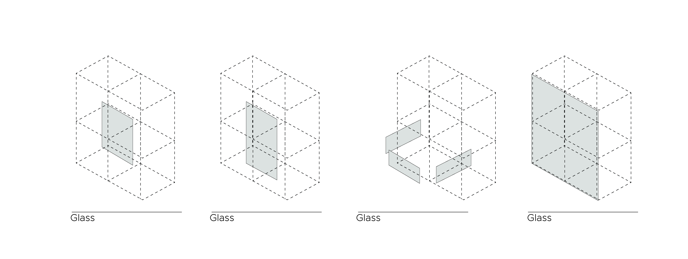

# Forming

### Creating lattices

Before we did any designing on a tileset we wanted to clarify on what parts of the facade we were going to distinguish between. We explained this in the diagram that you can see below. 


After making sure knew what parts of the building will get a different facade we were easliy able to design some tile sets. As you can see in this diagram we do not differentiate between north, south, east or west but in different lattices with equal facades. Therefor we use the following symmetry stencil: 

``` Python 
Sym_str = [["OO"], ["XX", "YY"], ["ZP"], ["ZN"]]
```

### Creating the tiles
With this stencil we start with the design of the subtile set consisting of 17 subtiles. Below you can see how we approached this. We started by designing the complete subtile set with two different materials. Our idea was that the main outer part, facing the streets, would have a more massive somewhat closed look with a lot of brick, and very deep window frames. And the inner part would become a more transparent facade to get as much daylight enter the building as possible. And the ground floor would also consist of brick to connect with the main outer part but have a more transparent look with a lot of glass. For the sake of these concepts we designed the following subtile sets.

    

But after finding out that we can only export the final mesh as a complete mesh without being able to assign different textures, we decided to split the tiles up in different materials. In the end we will export all the sets per material as one mesh. Below you can see the set we made for the brick.

  

The same we did for all the glass.

  

 <span style="color: #76AB24;">* We didn't succeed to succesfully aply the tileset for the balconies. The lattice almost becomes like a checkerboard, and therefore the Boolean Marching Cubes algorithm doesn't recognize a lot of corners.*</span>

### Pseudo code

``` Python
1. Generate symmetry stencil

2. Generate lattice

3. Profiling
Find all the unique corner arrangements
Create a lattice out of the unique profiles

4. Construct the tile set
Load subtile meshes
Combine subtile meshes to create tile meshes

5. Create lattices
Load envelope lattice
Remove the inner voxels to create the facade lattice
Create the ground floor lattice
Create the inner part lattice
Create the main outer part lattice
Create the balcony lattice

6. Extract the cube lattice
Run the Boolean marching cube algorithm for every single lattice

7. Tile the cube lattice with the tileset
Create the facade by assigning a tile set with a cube lattice
Save the final mesh
```
[Polygonization full notebook](..........)
