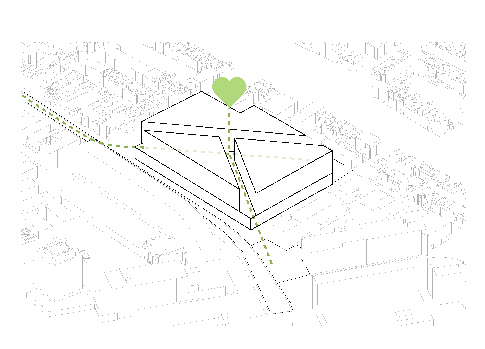
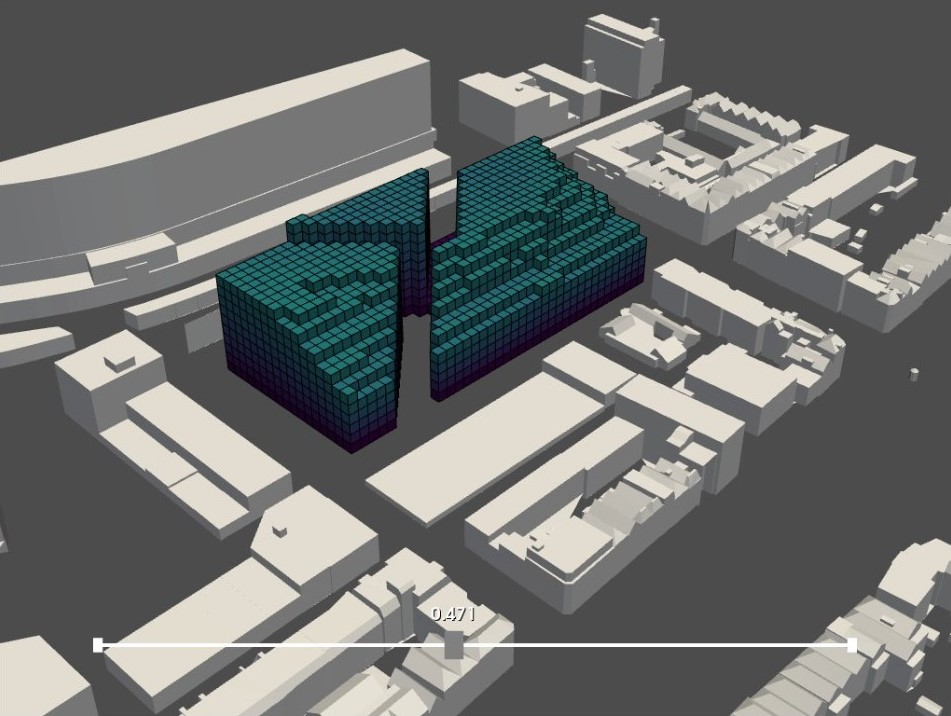
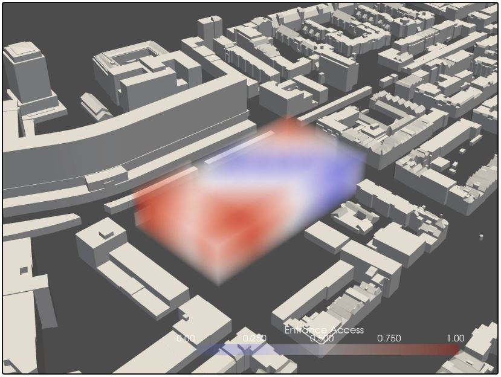
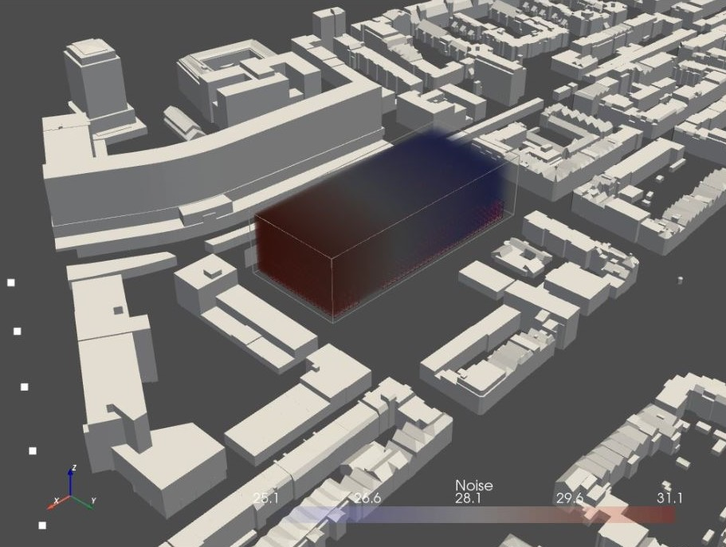
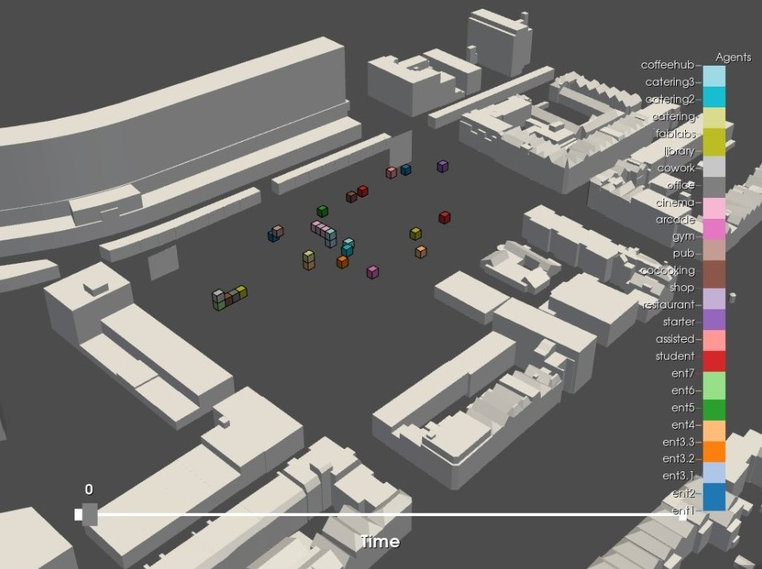
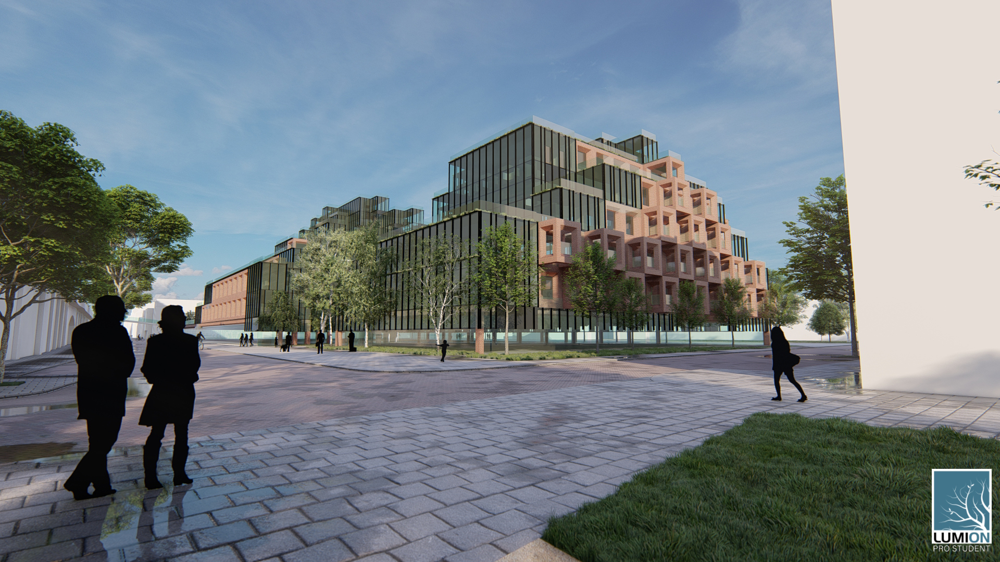
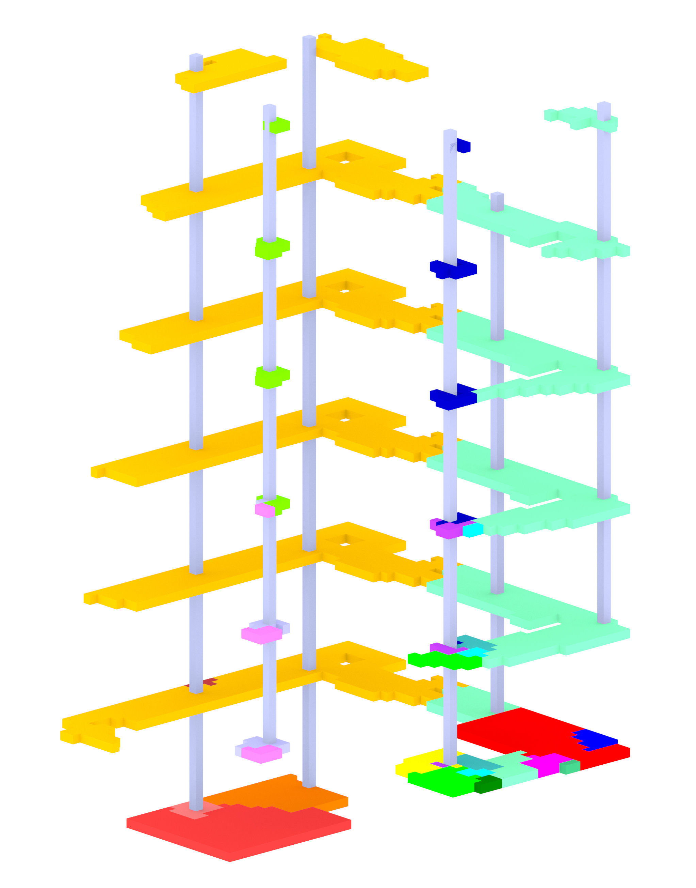
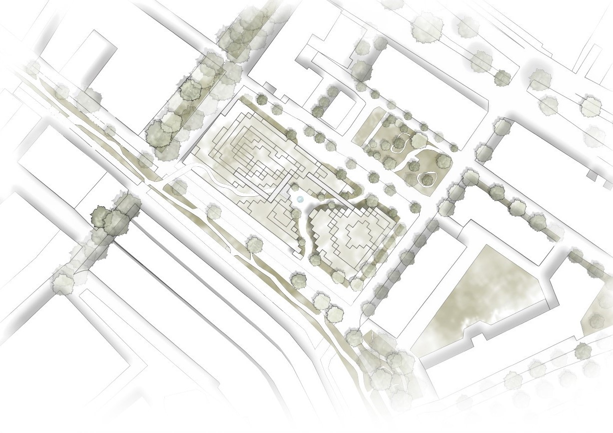

# Figures

## Planning 

### Process

### Product

## Configuring

### Process

### Product
-

## Massing

### Process

### Product

AGENT GROWTH

## Forming

### Process

 

   

 

 

### Product

## Result

 

 