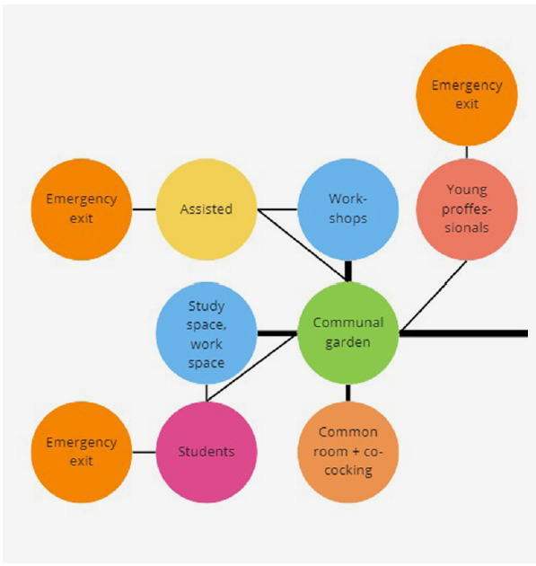

# Figures

##### Planning

[Plot](https://sanderbentvelsen.github.io/spatial_computing_project_template/a1_planning_process/)

[Sustainability](https://sanderbentvelsen.github.io/spatial_computing_project_template/a1_planning_process/)
 

[Design goals](https://sanderbentvelsen.github.io/spatial_computing_project_template/a1_planning_process/)

[Context](https://sanderbentvelsen.github.io/spatial_computing_project_template/a1_planning_process/)

> Here you should include all of your figures and links to the pages that they have been used in.

[Relations matrix](../pdf/Relations_Matrix2.pdf)

Poging 2:

[Relations matrix2](../pdf/Relations_Matrix2.pdf)

You can embed your only videos like this:
<iframe width="1200" height="400" src="https://www.youtube.com/embed/APKmDYFQ1yU" frameborder="0" allow="accelerometer; autoplay; clipboard-write; encrypted-media; gyroscope; picture-in-picture" allowfullscreen></iframe>