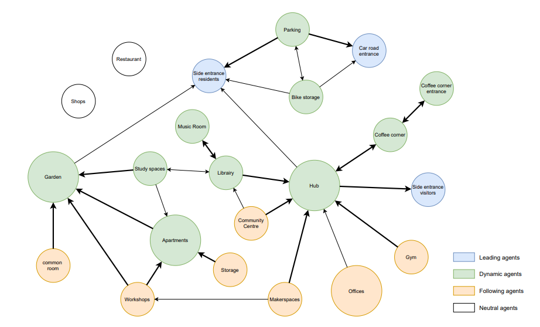
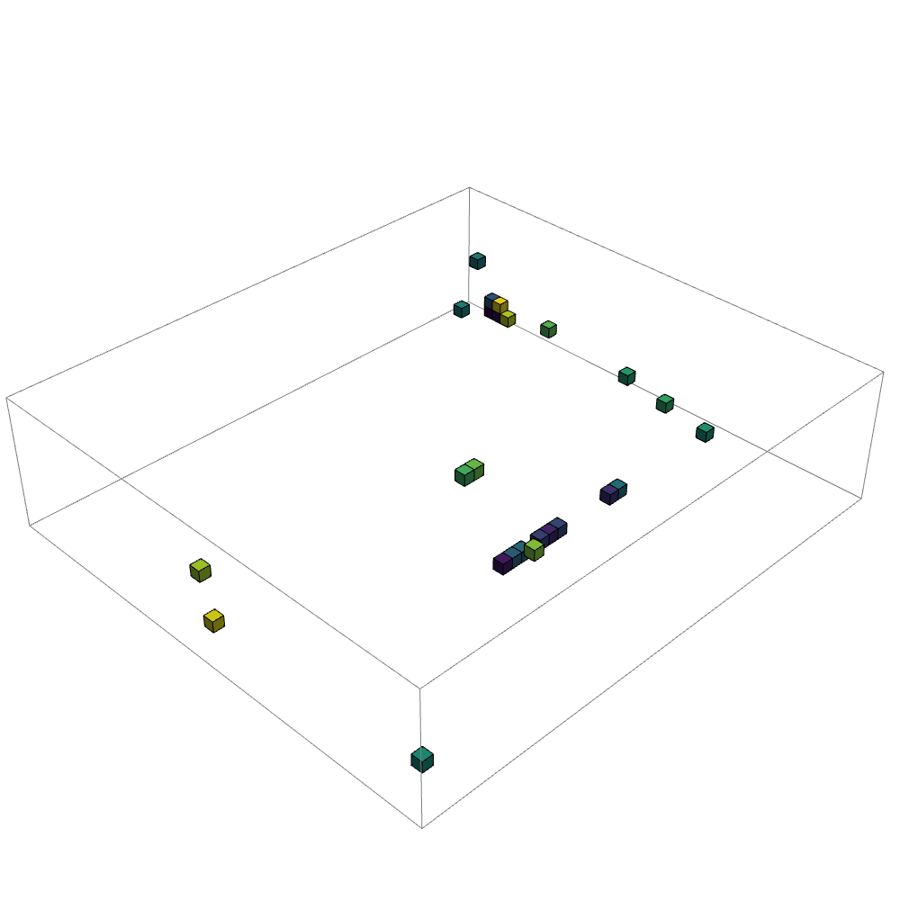
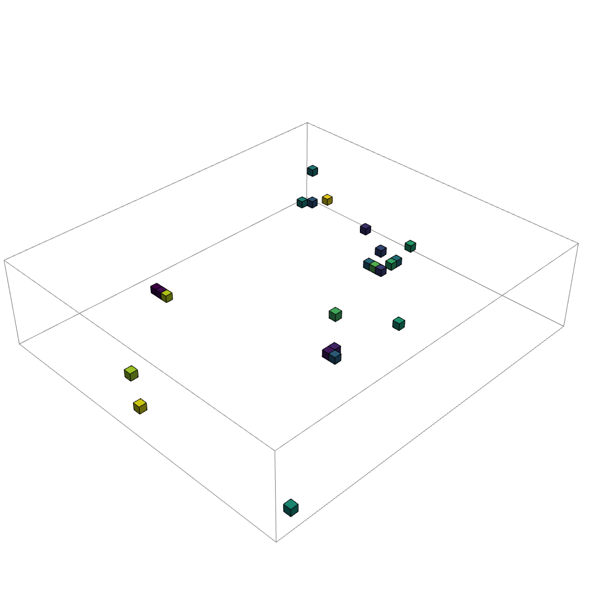
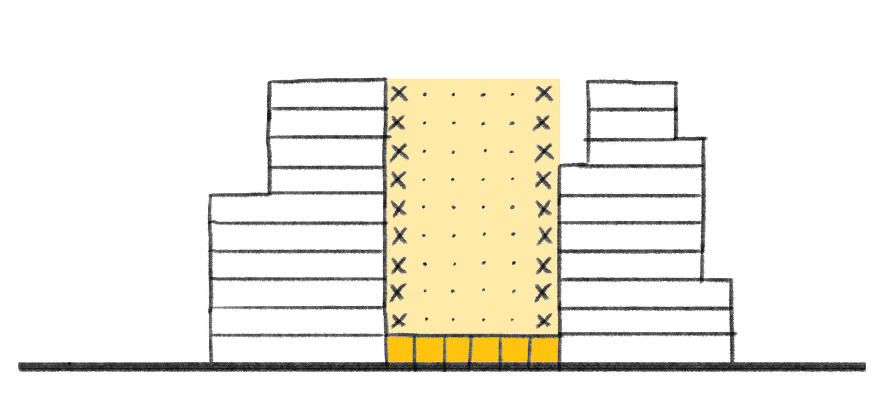
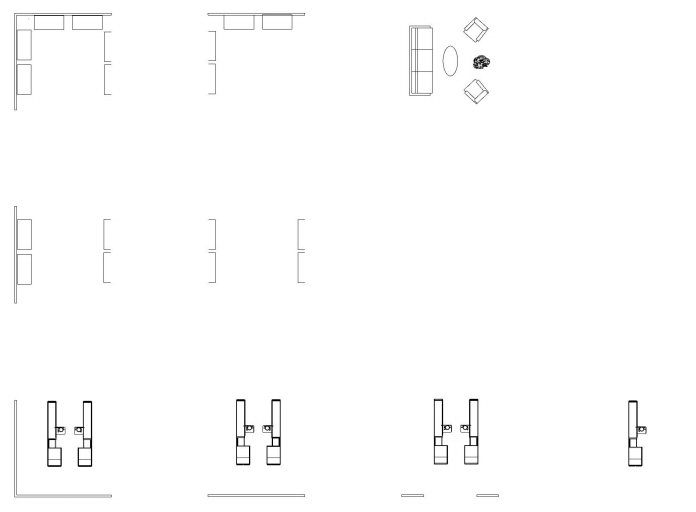
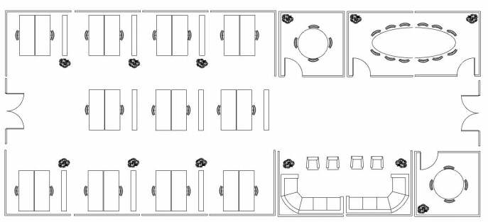

# Figures

##### Planning

[Plot](https://sanderbentvelsen.github.io/spatial_computing_project_template/a1_planning_process/)
 

[Sustainability](https://sanderbentvelsen.github.io/spatial_computing_project_template/a1_planning_process/)
 

[Design goals](https://sanderbentvelsen.github.io/spatial_computing_project_template/a1_planning_process/)
 
 
 
 

[Context](https://sanderbentvelsen.github.io/spatial_computing_project_template/a1_planning_process/)

<iframe src="../pdf/Residential perspectives.pdf" style="width:100%; height:400px;" frameborder="0"></iframe>

##### Configuring

 
 

 
 
 
 
 
 
 
 
 
 
 
 
 
 
 
 

##### Massing

 

##### Forming

